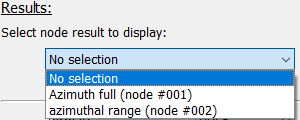
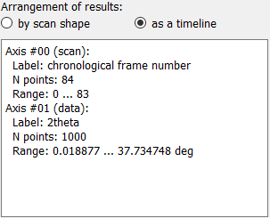

The Execute workflow frame
==========================

The "Run full processing" frame is split in two main parts. On the left are the 
controls for configuring the automatic saving and for running the Workflow as 
well as for manual data export. The right part of the frame is taken by a 
visualization widget for 1d plots or 2d images, depending on the result 
selection.

.. image:: ../../images/frames/execute_workflow_01_overview.png
    :width:  457px
    :align: center

The configuration on the left holds four different functions which will be 
described in more detail below:

  - Configuration of the automatic result saving
  - Running the processing
  - Selecting the results to be plotted
  - Manually exporting results

Detailed description of frame items
-----------------------------------

Configuring the automatic saving
^^^^^^^^^^^^^^^^^^^^^^^^^^^^^^^^

.. image:: ../../images/frames/execute_workflow_02_autosave_inactive.png
    :width:  300px
    :align: left
    
The configuration of the automatic saving is the topmost item on the left of the
frame. By default, autosaving the results is disabled and only the toggle 
Parameter to enable it is visible. Enabling the autosave will show two 
additional Parameter configuration widgets to select the saving directory and 
the type of files. 

.. image:: ../../images/frames/execute_workflow_03_autosave_active.png
    :width:  300px
    :align: left

Files will be automatically created based on different autosave formats selected
in the Parameter.

.. note::

    The autosave directory must be an empty directory at the start of the 
    processing, even though this condition is not enforced at the time of 
    selection.
    
Running the processing
^^^^^^^^^^^^^^^^^^^^^^

.. image:: ../../images/frames/execute_workflow_04_processing_to_start.png
    :width:  300px
    :align: left

The processing can be started with a click on the corresponding button. This 
will show a progress bar and an "Abort" button. 

.. image:: ../../images/frames/execute_workflow_05_processing_active.png
    :width:  300px
    :align: left
    
The "Abort" button will let the user send termination signals to the worker 
processes and - depending on the type of calculations - may take a while to take 
effect because the current process might not accept the termination signal 
until it starts a new job.

Selection of results
^^^^^^^^^^^^^^^^^^^^ 

.. image:: ../../images/frames/execute_workflow_06_results_no_selection.png
    :width:  300px
    :align: left

Results from individual nodes can be selected from the drop-down menu. Opening
it will show a list of all nodes in the WorkflowTree with stored results (see 
image below).

Once a node has been selected, additional information for these node's results 
will be displayed, see the image to the left.

.. image:: ../../images/frames/execute_workflow_08_results_full_selector.png
    :width:  305px
    :align: left

Arrangement
"""""""""""

For some applications, it can be interesting to arrange the results not by
scan shape but as a timeline, effictively collapsing all scan dimensions to a 
single frame index dimension. Changing between the two is done by selecting the
corrsponding radio button item. This will also trigger an update of the results
metadata, as seen on the image to the right.

Data description
""""""""""""""""

The different data axes are described in detail in the text field. The axes are
labelled with *scan* or *data*, depending on whether the respective data axis
has been defined in the scan or is an axis from the processed data. In addition,
the axis label (either from the scan definition or from the plugin data 
dimension) is given with the number of points in this axis and the axis range.

Plot definition
"""""""""""""""

The user can select between 1-dimensional line plots or 2-dimensional images.
Depending on the selection, one or two drop-down menus are shown which allow 
to select the dimensions to be used in the plot. In addition, the slice points
for additional dimensions must be specified to show the correct data subset. 

.. tip::
    The default data dimensions are zero (and one in case of a 2d image) and the 
    default slices are all zero. These values will probably need to be modified
    to show a useful plot or image.
    
Confirmation
""""""""""""

The "Confirm selection" button will process the inputs given above and will 
select the corresponding data subset and pass it to the plot widget.

Data export
^^^^^^^^^^^

.. image:: ../../images/frames/execute_workflow_10_export.png
    :width:  303px
    :align: left

The data export section allows users to export results either for the current
node or for all nodes.

.. note::

    The export will always export the full node dataset, not just the subset 
    which has been selected for display.
    
The first Parameter allows to select the export format(s). The second Parameter
controls overwriting of results. If True, existing data files will be 
overwritten without any additional warning. If False and an existing file is
detected, an Exception will be raised.

Clicking either the "Export current node results" or the "Export all results"
button will open a dialogue to select the folder.

.. note::

    To achieve naming consistency, it is not possible for the user to change
    the filenames of exported data, only the directory.

Presentation of 1D plots
^^^^^^^^^^^^^^^^^^^^^^^^ 

