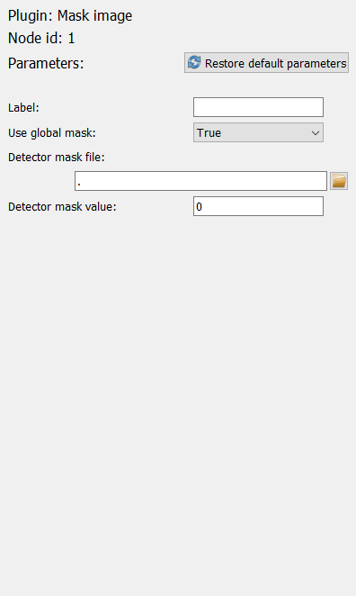

The Workflow edit frame
=======================

The :py:class:`WorkflowTree <pydidas.workflow.workflow_tree._WorkflowTree>` can 
be visualized and edited in the Workflow edit frame. The starting layout of the 
frame is shown below.

.. image:: ../../images/frames/workflow_edit_01_overview.png
    :width:  469px
    :align: center

The frame holds three main widgets (1-3) as well as control buttons (4). The 
top left widget (1) :ref:`visualizes the WorkflowTree <workflow_tree_vis>` and 
the Plugin collection is presented in the widget at the bottom (2). Widgets to edit a plugin are shown
on the right (3).

Detailed description of frame items
-----------------------------------

.. _workflow_tree_vis:

Workflow tree visualization
^^^^^^^^^^^^^^^^^^^^^^^^^^^

.. image:: ../../images/frames/workflow_edit_02_workflow_tree.png
    :width:  500px
    :align: center

The image above shows an example WorkflowTree visualization. Each plugin is 
depicted in a box with its name (1). Connections between plugins are displayed 
with lines (labeled with as asterisk). By clicking on a plugin, this plugin gets 
selected and is highlighted (thicker border, bold print and change in background
color). In addition, the :ref:`workflow_plugin_param_editing` widget will 
display the selected plugin's Parameters. 

.. tip::
    New plugins will always be children of the active plugin and adding a new
    plugin will also activate that plugin.
    
    To make a branching tree, you will need to activate the original plugin 
    again after adding a first new plugin.

.. _workflow_plugin_presenter:

Plugin collection presenter
^^^^^^^^^^^^^^^^^^^^^^^^^^^ 

.. image:: ../../images/frames/workflow_edit_03_plugin_presenter.png
    :width:  500px
    :align: center

The Plugin collection presenter consists of two parts. On the left, it will show
all Plugins which have been registered with the :py:class:`PluginCollection
<pydidas.plugins.PluginCollection>` (for more information about how paths are
managed, please refer to :ref:`global_plugincollection`).

A single click on a Plugin's name on the left will show more information about 
the selected Plugin on the right. This information included the description, a 
full list of Parameters, the input and output data dimensions as well as further 
programmatic information (class name and plugin type). 

A double click on a Plugin's name will append a new instance of the Plugin to 
the :py:class:`WorkflowTree <pydidas.experiment.workflow_tree._WorkflowTree>`. 
The new instance will always be appended to the currently active Plugin (or it
will become the new root Plugin if the Tree is empty).

.. _workflow_plugin_param_editing:

Plugin Parameter editing
^^^^^^^^^^^^^^^^^^^^^^^^

After selecting a Plugin in the :ref:`workflow_tree_vis`, the Plugin Parameter
editing widget will be updated with the information from the selected Plugin. 
The first two lines are the plugin name and the node ID.

The "Restore default Parameters" button can be used to reset all of the active 
plugin's Parameters to their defaults. 

Below, all of the Plugin's Parameters are listed. Please refer to the 
:ref:`gui_editing_parameters` manual on how to change these. 

All Plugins have a Parameter called ``label`` which allows the user to give the 
plugin a reference name. The other Parameters are Plugin-specific and will not
be discussed here.

.. tip::

    When saving Workflow results, the filenames will be in the format
    
    node\ _\ **<node ID>**\ _\ **<label>**\ _\ <plugin_class>.<extension> 
    
    where all placeholders in <> brackets will be replaced by values. Users are
    therefore encouraged to select meaningful labels for their Plugins and to 
    make a note of the plugin node IDs.

Import and Export
^^^^^^^^^^^^^^^^^

.. image:: ../../images/frames/workflow_edit_05_import_export.png
    :width:  399px
    :align: left

Workflows can be imported and exported using the respective buttons in the 
bottom right corner of the frame. Both buttons will open a file selection 
dialogue and have filters implemented to allow only supported file types and 
extensions.

Using the WorkflowTree
----------------------

The :py:class:`WorkflowTree <pydidas.workflow.workflow_tree._WorkflowTree>` 
is not used directly by the users but the information is required in 
applications, e.g. to run processing workflows.
