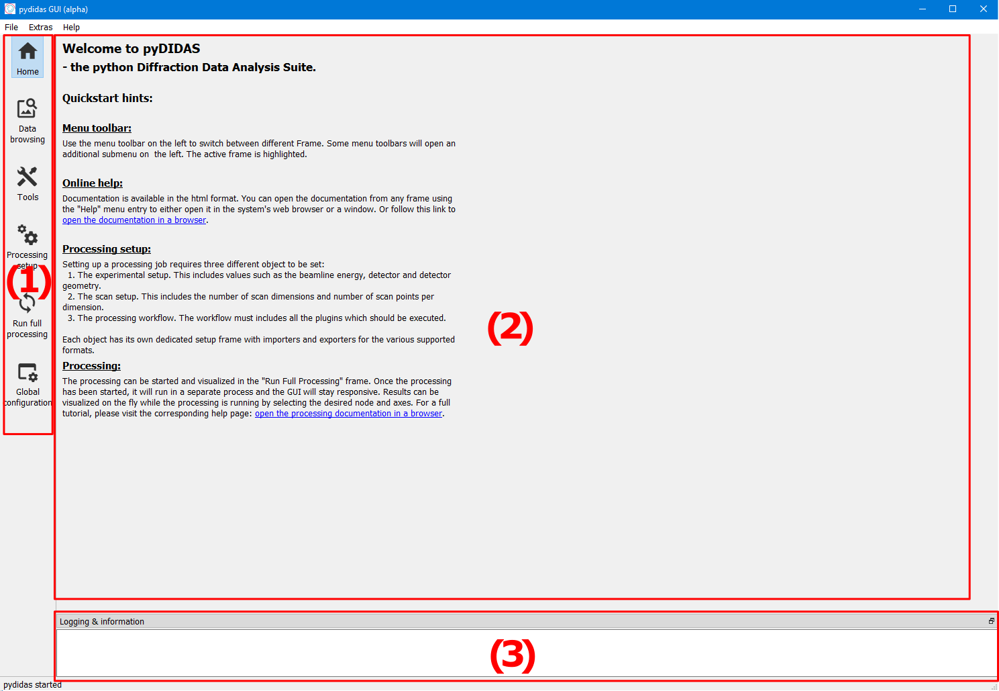

Graphical user interface
========================

The graphical user interface is organized in Frames which are independent of 
each other and which each hold persistent information during each session. 

The individual :ref:`gui_frames` are presented below before :ref:`gui_recipes` 
are described which give a detailed guide on individual use cases.

In addition to the menu bar at the top and the status bar at the botom, the 
pydidas GUI has three main components which are also labelled in the image 
below:

1. The menu toolbar on the left allows quick access to all pydidas Frames. Note 
   that some toorbars will expand a further toolbar. 
2. The main application area where the frames are displayed and user interaction 
   occurs. 
3. The logging and information area is located at the bottom of the window. This 
   area is dockable and can be dragged around and undocked into a floating 
   window.

After starting the GUI, the home frame gives links to the documentation and a 
very brief reminder how to set up the processing pipeline. Different frames can
be selected by clicking on the corresponding toolbar icons on the left.

Generic GUI tutorials
---------------------

.. toctree::
    :maxdepth: 1
    
    gui/editing_parameters

.. _gui_frames:

Frames
------

.. toctree::
    :maxdepth: 1
    
    frames/data_browsing
    frames/pyfai_calibration
    frames/composite_image_creator
    frames/experimental_settings
    frames/scan_settings
    frames/workflow_edit

.. _gui_recipes:

Recipes
-------