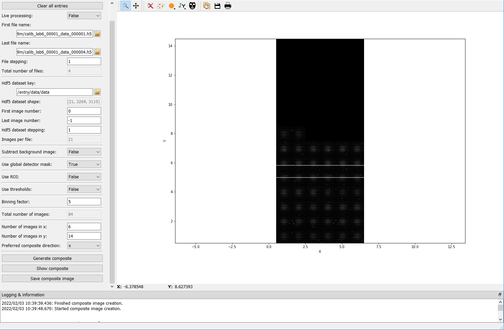

Composite image creator frame
=============================

The Composite image creator frame is a graphical interface to configure the 
:py:class:`CompositeCreatorApp <pydidas.apps.CompositeCreatorApp>` and to
visualize the results.

After starting the frame, only the menu for selecting the Parameters is visible.
For the tutorial about editing Parameters, please visit 
:ref:`gui_editing_parameters`. The full list of Parameters and their description
is given at the end in :ref:`composite_image_creator_params`. 

.. image:: ../../images/frames/composite_image_creator_01_starting_view.png
    :width: 600px
    :align: center

Control buttons
----------------

Clear all entries
^^^^^^^^^^^^^^^^^

.. image:: ../../images/frames/composite_image_creator_02_button_clear.png
    :align: left

The "Clear all entries" button at the top will reset all inputs to their default
values. Note that no confirmation will be asked of the user.

Generate composite
^^^^^^^^^^^^^^^^^^

.. image:: ../../images/frames/composite_image_creator_03_button_generate.png
    :align: left

Once the bare minimum Parameters have been selected (this is the first file name
and in case of an Hdf5 file the dataset), the "Generate composite" button will 
be enabled. Clicking the button starts an :py:class:`AppRunner <pydidas.multiprocessing.AppRunner>`
process which loads and processes the images in parallel processes.

Once clicked, the "Generate composite" button will be disabled and a 
progress bar as well as an "Abort" button will appear:

.. image:: ../../images/frames/composite_image_creator_04_button_abort.png
    :align: left

The progress bar will update with each received image and it shows the global
processing progress. The "Abort" button will stop the AppRunner. Any data 
received by the Frame up to this point will be kept but the rest of the 
composite image will only consist of zeros. The progress bar and "Abort" button 
will be hidden again after the Composite creation has finished.

.. note:: 
    After starting the AppRunner, it is normal that the first results need
    a few seconds to arrive because the new processes need to be started and
    load all required python packages.

Show composite
^^^^^^^^^^^^^^

.. image:: ../../images/frames/composite_image_creator_05_button_show.png
    :align: left

During processing, the composite image is automatically updated. If the uses
requires an additional manual update, the "Show composite" button can be used
to perform this update.

Save composite image
^^^^^^^^^^^^^^^^^^^^ 

.. image:: ../../images/frames/composite_image_creator_06_button_save.png
    :align: left

The "Save composite image" button opens a dialogue to select a file name. The 
image type is determined automatically based on the selected file extension.
A filter for all supported data types can be selected at the bottom of the 
dialogue.

Result visualization
--------------------

Results are visualized in a `silx PlotWindow 
<http://www.silx.org/doc/silx/latest/modules/gui/plot/plotwindow.html#module-silx.gui.plot.PlotWindow>`_.

The PlotWindow can be controlled by the menu bar at the top of the plot canvas.

The individual menu items are described in the table below.

.. include:: ../silx/imageview.rst

.. _composite_image_creator_params:

Full list of Composite image creator Parameters
-----------------------------------------------

.. include:: ../cmdline_apps/composite_creator_app_params.rst
