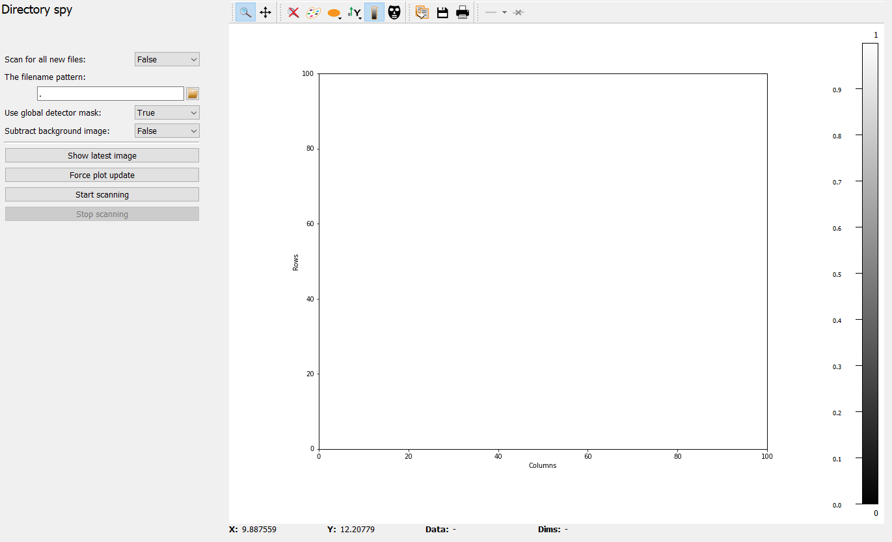
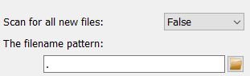

Directory spy frame
===================

The *Directory spy* frame is a graphical interface to configure and run the 
:py:class:`DirectorySpyApp <pydidas.apps.DirectorySpyApp>`. It is split in two 
main parts: On the left are the controls for configuring and running the 
application. The right part of the frame is taken by a visualization widget for 
the latest images read from the :py:class:`DirectorySpyApp 
<pydidas.apps.DirectorySpyApp>`.

The configuration on the left holds widgets to configure all necessary
application Parameters as well as to start and stop running the actual 
application.

Detailed description of frame items
-----------------------------------

Configuring the input
^^^^^^^^^^^^^^^^^^^^^

The default settings of the app is to scan for files corresponging to a specific
naming pattern (including the full directory path). An existing file can be
selected using the *Open* button and its filename modified to exchange the 
counters in the filename with hashtags.

.. image:: ../../images/frames/directory_spy_03_directory_path.png
    :align: right

If the ``scan_for_all`` option has been selected, the required Parameter for the 
directory path is shown and clicking on the *Open* icon will open a dialogue to
select a directory. Note that the Hdf5 dataset key Parameter is also shown and
this dataset is looked for in all new files in the specified folder.

An example of a filename with wildcards is given on the left. Note that the Hdf5 
dataset key Parameter widget is also shown automatically because a hdf5 file 
extension was detected.

.. image:: ../../images/frames/directory_spy_04_wildcard_pattern.png
    :align: left

| 
| 
| 
| 
| 
| 

Image corrections
^^^^^^^^^^^^^^^^^

.. image:: ../../images/frames/directory_spy_05_corrections.png
    :align: left

The *Directory spy frame* allows to mask the images with the global detector 
mask, toggled by changing the corresponding Parameter value. 

.. image:: ../../images/frames/directory_spy_06_corrections_bg.png
    :align: right

In addition, a generic background image can be subtracted from all images. If 
this option is selected, the widget to select the filename is shown. If an 
hdf5 file was selected, the widgets for the selection of dataset and frame 
number are shown as well, see image on the right.

    
Running the App
^^^^^^^^^^^^^^^

.. image:: ../../images/frames/directory_spy_07_running.png
    :align: left    

Running the :py:class:`DirectorySpyApp <pydidas.apps.DirectorySpyApp>` in this
frame will automatically display the latest update in the presentation widget
on the right.

A single directory scan can be performed by using the *Show latest image* 
button. This will also trigger a guaranteed update of the display widget.

A continuous process can be started by using the *Start scanning* button. This
process will run until the pydidas UI is stopped or the *Stop scanning* button
has been pressed. Updates to the display widget will be send based on the 
frequency set in the global settings.

.. note::
    If a pattern has been selected, the app will perform a single scan of the 
    whole directory upon starting to determine the latest image. To minimize
    file system access, it will then only look for the next consecutive file
    (and consequently, it will block if files are missing). To skip missing
    files, the user needs to restart the app.

.. tip::
    The minimum frequency in which the plot is updated is defined in the global
    settings. Therefore, if two updates came back-to-back, pydidas will 
    (depending on the settings) the second event and therefore will not show the
    latest image. A forced updated can be executed by using the *Force plot 
    update* button.

Presentation of image data
^^^^^^^^^^^^^^^^^^^^^^^^^^ 

Image data are presented in a `silx Plot2D widget 
<http://www.silx.org/doc/silx/latest/modules/gui/plot/plotwindow.html#silx.gui.plot.PlotWindow.Plot2D>`_\ .
The toolbar options will be explained in detail below. Moving the mouse over the
canvas will update the labels for x/y position and data value at the bottom of 
the canvas. Note that the x and y axis positions for each pixel are defined at
the pixel center and the given values must be treated carefully with respect to
the pixel shape, especially for coarse pixels.

.. tip::

    The scaling of the results can be achieved by modifying the colormap 
    settings.

Toolbar menu entries
""""""""""""""""""""

.. include:: ../silx/plot2d.rst