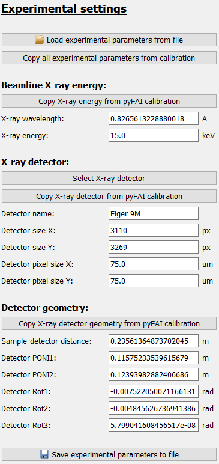

Experimental settings frame
===========================

The *Experimental settings* frame is a graphical interface to configure the 
:py:class:`SetupExperiment <pydidas.experiment.setup_experiment.setup_experiment._ExpSetup>` 
which holds information about the beamline setup.

The frame only holds the configuration widgets:

Detailed description of frame items
-----------------------------------

Load settings
^^^^^^^^^^^^^

.. image:: ../../images/frames/experimental_settings_02_button_load.png
    :align: left

Experimental settings can be loaded from file. Clicking the corresponding 
button will open a selection dialogue to pick the file with the stored settings.
File extensions will be pre-selected based on the available importers. 

Copy Parameters from calibration
^^^^^^^^^^^^^^^^^^^^^^^^^^^^^^^^

.. image:: ../../images/frames/experimental_settings_03_button_copyall.png
    :align: left

If a calibration using the :ref:`pyfai_calib_frame` has been performed during
the active session, clicking this button will copy all the required data from
the last successful fit in the pyFAI calibration tool. 

Beamline energy
^^^^^^^^^^^^^^^

.. image:: ../../images/frames/experimental_settings_04_energy.png
    :align: left

The beamline energy can either be copied from the pyFAI calibration tool (a 
warning will pop up if this option has been selected but no pyFAI calibration
is active) or the user can update the values for either the X-ray energy 
(in keV) or the wavelength (in A). Updating either of these values will also
modify the other value to keep them consistent.

Detector model
^^^^^^^^^^^^^^

.. image:: ../../images/frames/experimental_settings_05_detector.png
    :align: left

To select a detector and automatically update all detector Parameters, the 
"Select X-ray detector" button will open a new window (using the 
pyFAI DetectorSelectorDialog, see the screenshot below) which allows to select 
a detector based on manufacturer and model.

.. image:: ../../images/frames/experimental_settings_06_detector_popup.png
    :width: 361px
    :align: right

Confirming the selection in the dialogue will update all detector Parameters.  
 
Alternatively, if the detector has been selected in the pyFAI calibration, 
the detector Parameters can be copied from pyFAI by clicking the button "Copy 
X-ray detector from pyFAI calibration" or all Parameters can also be entered 
manually in the input fields.

Detector geometry
^^^^^^^^^^^^^^^^^

.. image:: ../../images/frames/experimental_settings_07_detector_geometry.png
    :align: left
    
pydidas uses the `Default geometry in pyFAI 
<https://pyfai.readthedocs.io/en/master/geometry.html#default-geometry-in-pyfai>`_ 
and the detector position is described by the sample-detector distance, two
positions for the point of normal incidence on the detector (PONI1 in vertical
and PONI2 in hprizontal directions) which describe the orthogonal projection of 
the origin (i.e. sample) on the detector and three rotations to modify the 
detector position.  Please refer to the pyFAI documentation for a detailed 
description.

These settings can be copied from the pyFAI calibration using the button or the
values can be entered manually.

Saving
^^^^^^

.. image:: ../../images/frames/experimental_settings_08_save.png
    :align: left
    
All settings can be exported to file using the saving button. Clicking the 
button will open a dialogue to select a filename. By default, a filename filter
for all supported extensions is active. The file type is selected automatically 
based on the extension.

Using the Experimental settings
-------------------------------

The :py:class:`SetupExperiment <pydidas.experiment.setup_experiment.setup_experiment._ExpSetup>` 
is not used directly but the information is required in applications, e.g. to
run processing workflows.
   
Full list of Experimental setup Parameters
------------------------------------------

.. include:: ../cmdline_global/setup_experiment_params.rst
