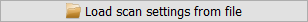
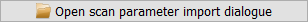
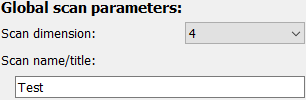

Scan settings frame
===================

The *Scan  settings* frame is a graphical interface to configure the 
:py:class:`SetupScan <pydidas.experiment.setup_scan.setup_scan._SetupScan>` 
which holds information about the beamline setup. The frame only holds the 
configuration widgets for its Parameters as well as some buttons for convenience
functionality.

.. image:: ../../images/frames/scan_settings_01_full.png
    :width:  321px
    :align: center

Detailed description of frame items
-----------------------------------

Load settings
^^^^^^^^^^^^^

The Scan settings can be loaded from file. Clicking the corresponding 
button will open a selection dialogue to pick the file with the stored settings.
File extensions will be pre-selected based on the available importers. 

Import dialogue
^^^^^^^^^^^^^^^

This button allows to access import functionality from beamline metadata. While
no common metadata format has yet been agreed on, this function will be 
implemented with the beamline specific formats in the near future.

.. note::
    For now, clicking this button has no effect. If you desire this function,
    please talk to your beamline local contact and ask for a common metadata
    format.

Reset Parameters
^^^^^^^^^^^^^^^^

.. image:: ../../images/frames/scan_settings_04_reset.png
    :align: left

The "Reset all scan settings" button allows the user to change all Parameters
back to their default values. 

Global Parameters
^^^^^^^^^^^^^^^^^

Here, *global* refers to general scan Parameters in contrast to Parameters for 
a specific scan dimension. The number of scan dimensions can be selected here 
and this setting will also update the visibility of the configuration widgets 
for the selected scan dimensions. 

A general scan title can be selected as well. This can be used as metadata for
plot titles etc.

Configuring a scan dimension
^^^^^^^^^^^^^^^^^^^^^^^^^^^^

.. image:: ../../images/frames/scan_settings_06_dimension.png
    :align: left

The configuration for each scan dimension is the same, and dimension #3 is shown
only exemplarily. 

Each scan dimension has one mandatory field which is the number of scan points. 
This number determines the layout of the data in pydidas. The other information
is metadata which is used to determine labels and axis ranges for plots but
which has no further relevance. The name of the scan dimension corresponds to
the label. The unit is also used to label the dimension range.

The range of each scan dimension is determined by the number of points 
:math:`N`, the step width :math:`\Delta x` between two points and the offset 
:math:`x_0`. The full range is thus

.. math::

    x_0,\ x_0 + \Delta x,\ x_0 + 2 * \Delta x,\ ...,\ x_0 + (N - 1) * \Delta x.

Using the Scan settings
-------------------------------

The :py:class:`SetupScan <pydidas.experiment.setup_scan.setup_scan._SetupScan>` 
is not used directly but the information is required in applications, e.g. to
run processing workflows.
   
.. _setup_scan_params:

Full list of Scan settings Parameters
-------------------------------------

.. include:: ../cmdline_global/setup_scan_params.rst
