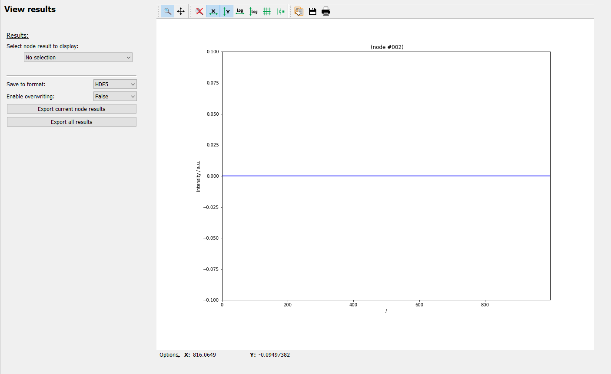

The View workflow results frame
===============================

The "View workflow results" frame is very similar to the "Run full processing"
frame except that it does not allow to start the processing.

The idea is to allow exploration of results without forcing an update of the
results if the WorkflowTree has changed.

The configuration on the left holds two different functions which will be 
described in more detail below:

  - Selecting the results to be plotted
  - Manually exporting results

Detailed description of frame items
-----------------------------------

.. include:: ./workflow_result_selection.rst

.. include:: ./workflow_result_export.rst

.. include:: ../silx/plot1d.rst

.. include:: ../silx/plot2d.rst
