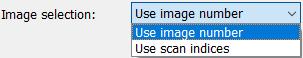
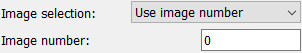
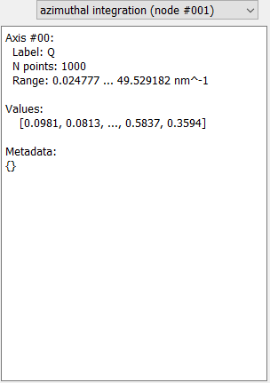

The Workflow test frame
=======================

The Workflow test frame can be used to run the 
:py:class:`WorkflowTree <pydidas.workflow.workflow_tree._WorkflowTree>` locally
for a single data point and visualize all results, including intermediate 
results.

.. image:: ../../images/frames/workflow_test_01_overview.png
    :width:  468px
    :align: center

The frame holds control widgets on the left and plot canvas on the right.

Detailed description of frame items
-----------------------------------

Image selection
^^^^^^^^^^^^^^^

A single frame must be selected to test the 
:py:class:`WorkflowTree <pydidas.workflow.workflow_tree._WorkflowTree>`. Two 
options exist for selecting the frame which can be toggled by the "Image 
selection" Parameter (see image on the right). 

Using the "Image number" entry, a datapoint can be selected by its absolute 
number in the acquisition sequence (i.e. chronologically). This number must be
given in the "Image number" Parameter field.

.. image:: ../../images/frames/workflow_test_04_scan_indices.png
    :align: left

Selecting the "Use scan indices" will allow the user to pick a datapoint based
on its position in the scan. Parameters for all defined scan dimensions are 
shown and must be used to select the desired datapoint.

Processing
^^^^^^^^^^

Clicking the "Process frame" button will start the workflow processing.

.. note::

    Depending on the selected workflow, this operation might take a few seconds
    and the GUI will be unresponsive during processing.
    (Any pyFAI integration will require an initialization which takes several
    seconds.)

Results
^^^^^^^

.. image:: ../../images/frames/workflow_test_05_result_selection.png
    :align: left

After running the local processing, the results for the different nodes can be
visualized by selecting the corresponding entry from the results drop-down
selection. This will open a text box with additional information about the 
plugin results. If the results are a one-dimensional dataset, a plot is shown in
the plot widget and if the results are two-dimensional, the image is shown in
the plot widget. For any other dimensions, only the text information will be 
shown.

