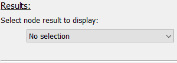
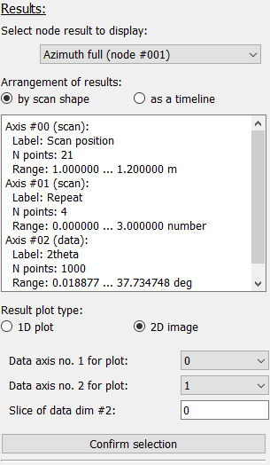

Selection of results
^^^^^^^^^^^^^^^^^^^^ 

Results from individual nodes can be selected from the drop-down menu. Opening
it will show a list of all nodes in the WorkflowTree with stored results (see 
image below).

.. image:: ../../images/frames/execute_workflow_07_results_dropdown.png
    :align: right

Once a node has been selected, additional information for these node's results 
will be displayed, see the image to the left.

Arrangement
"""""""""""

For some applications, it can be interesting to arrange the results not by
scan shape but as a timeline, effictively collapsing all scan dimensions to a 
single frame index dimension. Changing between the two is done by selecting the
corrsponding radio button item. This will also trigger an update of the results
metadata, as seen on the image to the right.

.. image:: ../../images/frames/execute_workflow_09_results_timeline.png
    :align: right

Description of metadata
"""""""""""""""""""""""

The different data axes are described in detail in the text field. The axes are
labelled with *scan* or *data*, depending on whether the respective data axis
has been defined in the scan or is an axis from the processed data. In addition,
the axis label (either from the scan definition or from the plugin data 
dimension) is given with the number of points in this axis and the axis range.

Plot definition
"""""""""""""""

The user can select between 1-dimensional line plots or 2-dimensional images.
Depending on the selection, one or two drop-down menus are shown which allow 
to select the dimensions to be used in the plot. In addition, the slice points
for additional dimensions must be specified to show the correct data subset. 

.. tip::
    The default data dimensions are zero (and one in case of a 2d image) and the 
    default slices are all zero. These values will probably need to be modified
    to show a useful plot or image.
    
Confirmation
""""""""""""

The "Confirm selection" button will process the inputs given above and will 
select the corresponding data subset and pass it to the plot widget.
