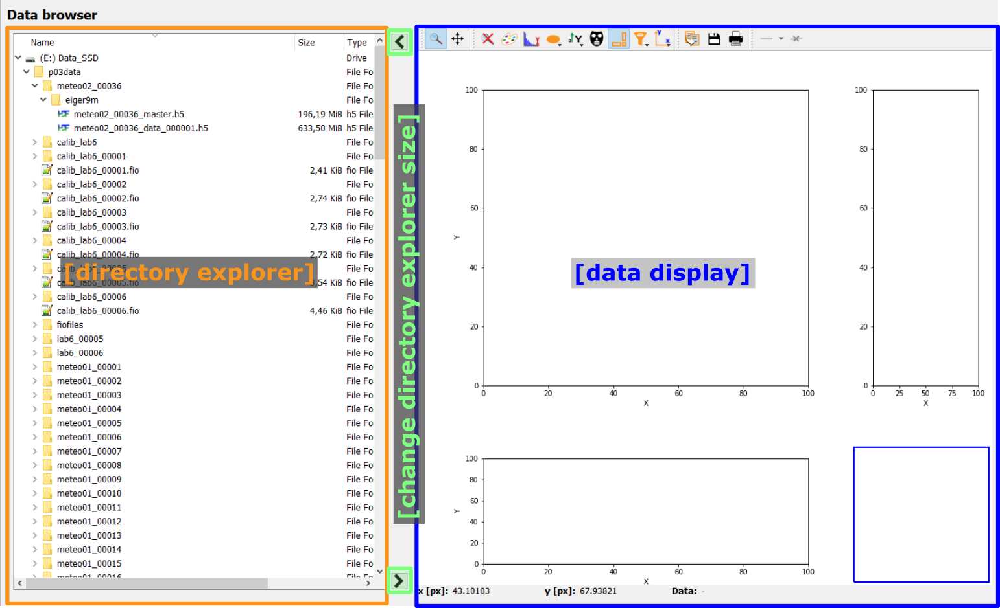
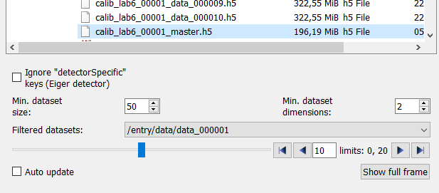

.. 
    Copyright 2021-, Helmholtz-Zentrum Hereon
    SPDX-License-Identifier: CC-BY-4.0

.. _data_browsing_frame:

Data browsing frame
===================

.. contents::
    :depth: 2
    :local:
    :backlinks: none
    
The data browsing frame allows the visualization of two-dimensional data.
The frame is divided in two main parts: On the left, a directory explorer allows
to browse the full file system and select files. The right side, a data display
allows to visualize data. 

    
The width of the directory explorer widgets can be adjusted by using the two 
arrow buttons in between the two main widgets, to reduce or to enlarge the 
directory explorer, respectively. Alternatively, the splitter between the two 
frames can be dragged by the mouse to change the relative sizes. 

.. warning::

    The two main widgets have a defined minimum size. If the user drags the 
    splitter further, the respective widget will be hidden. It can be enlarged
    again by capturing and dragging the slider from the edge towards the center.
    

Directory explorer
^^^^^^^^^^^^^^^^^^

The directory explorer is used to select the data to be displayed. The exact
look and feel will depend on the used operating system and might be different
from the screenshots shown here.

A single click on an item will just highlight the item but will otherwise be 
ignored. Double-clicking on a folder (or the arrow next to a folder) will 
expand or collapse the folder, depending on the folder's current state. 
Double-clicking on a file will instruct pydidas to open the selected file. If 
the data format is readable and the file contains two-dimensional data, the 
content will be displayed in the ImageView widget. In case of hdf5 files, an
aditional selection field will be shown to select the data frame. 

The hdf5 data selection widget
""""""""""""""""""""""""""""""

The hdf5 data selection widget is shown below.

The first row allows the user to select dataset filters for specific names.
For example, the Eiger detector master file has a number of datasets for 
detector specific settings like offsets and calibrations for the different 
modules. If the respective box is ticked, these datasets will not be shown in 
the drop-down list. Additional filters for datasets can be set on their minimum
size (the total number of datapoints, not per axis) and minimum data dimension.
Any changes to the filters will update the list of filtered datasets 
immediately. 

To select a dataset, simply select the corresponding hdf5 dataset key from the 
list. This will update the selection of the data frame.

.. note::

    For three-dimensional datasets, pydidas will assume that the first dimension 
    in the dataset is always the frame number and the second and third 
    dimensions correspond to the detector data frame.
    
The data frame can be selected by dragging the slider, clicking on an arrow or
by entering a new number. Clicking on "Show full frame" will show the selected 
frame in the ImageView widget. 

.. note::

    Changing the selected frame will only trigger an update of the ImageView
    if the "Auto update" checkbox is ticked.

.. include:: ../silx/imageview.rst

