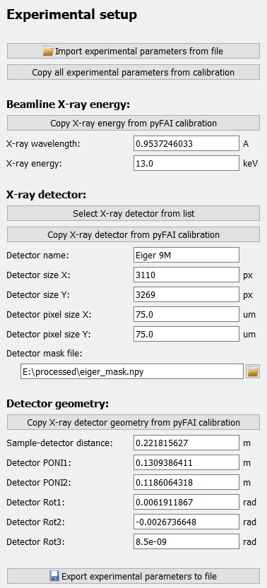
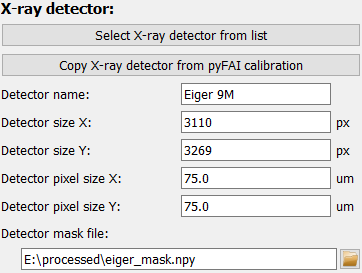
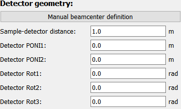

..
    This file is licensed under the
    Creative Commons Attribution 4.0 International Public License (CC-BY-4.0)
    Copyright 2023, Helmholtz-Zentrum Hereon
    SPDX-License-Identifier: CC-BY-4.0

.. _define_diffraction_exp_frame:

DefineDiffractionExpFrame
=========================

.. contents::
    :depth: 2
    :local:
    :backlinks: none
    
The *Define Diffrraction setup* frame is a graphical interface to configure the 
:py:class:`DiffractionExperimentContext 
<pydidas.contexts.diffraction_exp_context.DiffractionExperiment>` 
which holds information about the experimental/beamline setup.

The frame only holds the configuration widgets:

Detailed description of frame items
-----------------------------------

Import settings
^^^^^^^^^^^^^^^

.. image:: images/define_experiment_frame_button_import.png
    :align: left

Experimental settings can be import from file. Clicking the corresponding 
button will open a selection dialogue to pick the file with the stored settings.
File extensions will be pre-selected based on the available importers. 

.. _copy_from calibration:

Copy Parameters from calibration
^^^^^^^^^^^^^^^^^^^^^^^^^^^^^^^^

.. image:: images/define_experiment_frame_button_copyall.png
    :align: left

If a calibration using the :ref:`pyfai_calib_frame` has been performed during
the active session, clicking this button will copy all the required data from
the last successful fit in the pyFAI calibration tool. 

Beamline energy
^^^^^^^^^^^^^^^

.. image:: images/define_experiment_frame_energy.png
    :align: left

The beamline energy can either be copied from the pyFAI calibration tool (see 
:ref:`copy_from calibration`) or the user can update the values for either the 
X-ray energy (in keV) or the wavelength (in A). Updating either of these values 
will also modify the other value to keep them consistent.

Detector
^^^^^^^^

To select a detector and automatically update all detector Parameters, the 
"Select X-ray detector" button will open a new window (using the 
pyFAI DetectorSelectorDialog, see the screenshot below) which allows to select 
a detector based on manufacturer and model.

.. image:: images/define_experiment_frame_detector_popup.png
    :width: 361px
    :align: right

Confirming the selection in the dialogue will update the detector Parameters.  

|

Alternatively, the detector can be taken from the the pyFAI calibration, 
(see :ref:`copy_from calibration`) or all Parameters can also be entered 
manually in the input fields.

The last field of the detector group, the *Detector pixel mask* determines if 
a mask should be used for the pyFAI integration. This parameter is independent
of the other detector Parameters and is not updated with the selection of the 
detector. If empty, no detector mask will be applied to the pyFAI integration.

Detector geometry
^^^^^^^^^^^^^^^^^

    
pydidas uses the `Default geometry in pyFAI 
<https://pyfai.readthedocs.io/en/master/geometry.html#default-geometry-in-pyfai>`_ 
and the detector position is described by the sample-detector distance, two
positions for the point of normal incidence on the detector (PONI1 in vertical
and PONI2 in hprizontal directions) which describe the orthogonal projection of 
the origin (i.e. sample) on the detector and three rotations to modify the 
detector position. Please refer to the pyFAI documentation for a detailed 
description. For the user's convenience, the derived beamcenter pixel position
in detector pixel coordinates is also displayed.

In addition to taking these settings from the pyFAI calibration (see 
:ref:`copy_from calibration`) and manual Parameter updates , pydidas also offers 
a tool for manually setting the beamcenter. The button *Manual beamcenter 
definition* opens a new window. The window is described in detail in 
:ref:`manually_set_beamcenter_window`. 

.. image:: images/define_experiment_frame_convert_from_fit2d.png
    :width: 265px
    :align: right

The button *Convert Fit2D geometry* allows to convert an existing calibration 
in Fit2D geometry to pyFAI's PONI geometry. Clicking the button temporarily 
disables the frame's inputs and opens a new  window to input the existing 
calibration:
Input all parameters as required (sample-detector distance, beamcenter x/y, 
detector tilt plane and tilt angle). The *Convet to pyFAI geometry* button will
calculate the resulting pyFAI geometry parameters and display them in the bottom
parameter fields. The *Accept and store pyFAI geometry* button will close the 
window and copy the resulting geometry to the main frame.

Export
^^^^^^

.. image:: images/define_experiment_frame_export.png
    :align: left
    
All settings can be exported to file using the saving button. Clicking the 
button will open a dialogue to select a filename. By default, a filename filter
for all supported extensions is active. The file type is selected automatically 
based on the extension.

Using the Diffracion Experiment settings
----------------------------------------

The :py:class:`DiffractionExperimentContext 
<pydidas.contexts.diffraction_exp_context.DiffractionExperiment>` 
is not used directly by the user but the information is required in 
applications, e.g. to run processing workflows or to determine the beam center 
on the detector.
   
.. include:: ../../global/diffraction_exp_context_params.rst
