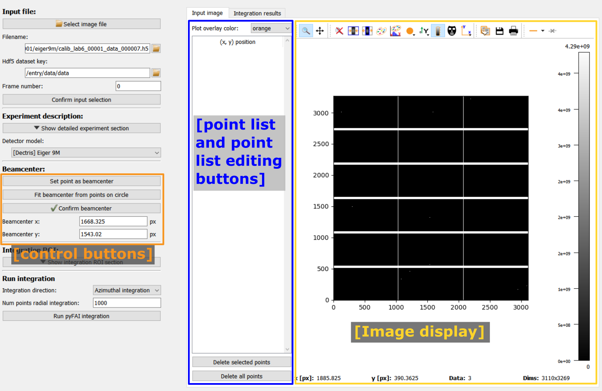
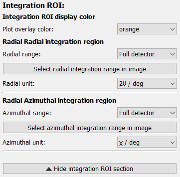

.. 
    Copyright 2021-, Helmholtz-Zentrum Hereon
    SPDX-License-Identifier: CC-BY-4.0

The Quick Integration frame
===========================

.. contents::
    :depth: 2
    :local:
    :backlinks: none

The *Quick integration* frame allows to perform a quick integration without 
needing to set up the full :py:class:`DiffractionExperimentContext
<pydidas.contexts.diffraction_experiment.DiffractionExperiment>` and 
:py:class:`ScanContext<pydidas.contexts.scan_context.Scan>`.

The frame does, however, have some limitations: Processing is limited to data
loading and integrating (azimuthal, radial or 2-dimensional) and the detector is
assumed to be perfectly aligned, i.e. all rotations are set to zero.

.. image:: images/quick_integration_frame_overview.png
    :width:  600px
    :align: center

The left side shows the configuration and most configuration options will become
available once an image has been imported. The right side holds two plots for
input image and integration results in tabs.

The configuration on the left holds the following functions which will be 
described in more detail below:

  - Input selection
  - Experiment description
  - Beamcenter
  - Integration region of interest
  - Run the integration

Input selection
---------------

The input file can be selected in any one of four ways:

.. image:: images/quick_integration_frame_input.png
    :align: left

1. Use the "Select image file" button at the top.
2. Enter the full file path in the input field.
3. Use the small "open" button right of the input field.
4. Drag and drop a file from the system's file explorer.

.. image:: images/quick_integration_frame_input_hdf5.png
    :align: right

If the filename is valid, the selected file will be displayed immediately.

For hdf5 files, however, you need to select data the dataset and frame number 
first and confirm the selection with the "Confirm input selection" button before
any frame is loaded and displayed.

After loading an image, the current integration region is shown as an overlay.
By default,the overlay is orange and will cover the full image (because the full
detector is used by default).

Experiment description
----------------------

.. image:: images/quick_integration_frame_experiment.png
    :align: left

The detailed experiment description is hidden upon startup. Default values for 
the detector pixel size, detector distance and X-ray energy allow to run any 
integration right away without needing to modify any values. The only Parameter
displayed directly is the detector model. If the shape of the input image 
corresponds to a known detector, the choices are updated correspondingly.
Choosing the correct detector model allows pyFAI to use the generic mask for 
this detector make, for example to mask module gaps.

.. note::
    The integration can be run directly with the defaults but as a result, the 
    scaling of the integration results (i.e. 2theta / Q / r values) are wrong.
    Nonetheless, the integration profile can be inspected and assessed.

.. image:: images/quick_integration_frame_experiment_full.png
    :align: right
    
The expanded experiment description section offers the options of importing a 
full calibration or by manually setting X-ray energy, sample-detector distance
and the detector pixel size. Note that square pixels are assumed. 

A custom detector mask can be used as well. This will take precedence over the
generic detector mask.

|
|

Beamcenter
----------

.. image:: images/quick_integration_frame_beamcenter.png
    :align: left

The beamcenter position (in detector pixel coordinates) can be set directly,
if it is known. The position is also updated if the experimental description 
has been imported. 

The "Start graphical beamcenter selection" button will toggle the graphical 
selection mode. This will show additional control buttons, a panel with a list
of selected points and disable other settings. In addition, clicking in the 
image will select the clicked pixel positions and store them in the list.

The image above shows the initial view after enabling the graphical beamcenter 
selection. The additional control buttons and center panel with the point list 
are described in detail below.

Image display
^^^^^^^^^^^^^

The image now remembers (left mouse button) clicks to store the pixel position
and also displays all points. Points are visualized by different symbols, as
explained below.

.. list-table::
    :widths: 5 95
    :class: tight-table
    :header-rows: 1

    * - point symbol
      - description
    * -  .. image:: images/quick_integration_frame_bc_point.png
            :align: center
      - A generic **x** marker to signal that this point has been stored.
    * -  .. image:: images/quick_integration_frame_bc_selected_point.png
            :align: center
      - Selected points are highlighted with a filled circle.
    * -  .. image:: images/quick_integration_frame_bc_center.png
            :align: center
      - The beamcenter is marker with a diamond-shaped marker.

Point list and controls
^^^^^^^^^^^^^^^^^^^^^^^

At the very top of the list is a configuration widget to change the color of all
the plot overlay items like the points to increase the contrast. 

The point list displays the positions of all clicked points. Left-clicking on
a point in the list will select this point and also highlight it in the image
by changing the marker. Multiple points can be selected by holding 
:py:data:`Shift` when selecting the second point to select all points inbetween
or by holding :py:data:`Ctrl` while selecting points to add only single points 
to the selection. All selected points will be highlighted in the image. 

The two buttons at the bottom of the point list allow to delete the current
selection of points or all points. The current selection of points can also be
deleted by pressing :py:data:`Del` while the plot list has the focus.

Control buttons
^^^^^^^^^^^^^^^

.. image:: images/quick_integration_frame_beamcenter_control_buttons.png
    :align: left

|
|
|
|

The control buttons allow give two choices for setting the beamcenter:

1. A single selected point can be set as beamcenter. This requires that exactly 
   one point was selected in the image. The beamcenter marker will be updated 
   and the coordinates will be copied as the new beamcenter.
   
2. A circle can be fitted through all selected points. The circle center is 
   taken as the beamcenter position. The circle fit will be shown with a dotted
   line to allow verification of the quality.
   
The last button, "confirm beamcenter" will disable the graphical beamcenter  
selection and enable the other configurations again.

Integration region of interest
------------------------------

    
The integration region of interest can be selected either by entering values 
for the radial and azimuthal range or graphically after clicking the 
"Select radial / azimuthal integration range in image" button.

Selecting radial integration range in image
^^^^^^^^^^^^^^^^^^^^^^^^^^^^^^^^^^^^^^^^^^^

If the azimuthal range is "Full detector", nothing will be displayed to start 
with. If a range has been selected, the limits of the range will be marked by 
two lines starting from the beamcenter. Clicking on the first point will set
the inner radial limit, which will be displayed as a circle. Clicking a second
time will set the upper limit and the selected integration ROI will be displayed
as overlay.

.. list-table::
    :widths: 33 33 33
    :class: tight-table
    :header-rows: 1

    * -  .. image:: images/quick_integration_frame_roi_azimuthal.png
            :align: center
            :width: 200
      -  .. image:: images/quick_integration_frame_roi_azimuthal_inner_radial.png
            :align: center
            :width: 200
      -  .. image:: images/quick_integration_frame_roi_final_roi.png
            :align: center
            :width: 200
    * -  The starting azimuthal limits without any radial selection.
      - After selecting the inner radial limit, it is shown as a circle.
      - After selecting the outer radial limit as well, the final integration
        ROI is displayed.

Selecting azimuthal integration range in image
^^^^^^^^^^^^^^^^^^^^^^^^^^^^^^^^^^^^^^^^^^^^^^

If the radial range is "Full detector", nothing will be displayed to start 
with. If a range has been selected, the limits of the range will be marked by 
two circles around the beamcenter. Clicking on the first point will set the 
starting radial limit and draw a line from the beamcenter. Clicking a second
time will set the upper limit and the selected integration ROI will be displayed
as overlay.

.. list-table::
    :widths: 33 33 33
    :class: tight-table
    :header-rows: 1

    * -  .. image:: images/quick_integration_frame_roi_radial.png
            :align: center
            :width: 200
      -  .. image:: images/quick_integration_frame_roi_radial_azi_start.png
            :align: center
            :width: 200
      -  .. image:: images/quick_integration_frame_roi_final_roi.png
            :align: center
            :width: 200
    * -  The starting radial limits without any azimuthal selection.
      - After selecting the lower azimuthal limit, it is shown as a line from 
        the beamcenter.
      - After selecting the upper azimuthal limit as well, the final integration
        ROI is displayed.

Run the integration
-------------------

.. image:: images/quick_integration_frame_run.png
    :align: left

To run, the integration, select the corresponding direction and number of points
from the list and click the button to run. The results will be displayed in the 
second plot tab, labeled *Integration results*.

Data visualization
------------------

Two separate plots for input and integration results are organized as tabs on 
the right side of the frame. 

The modified silx Plot1D and Plot2D widgets are used for displaying the data
and the are described in detail below.

.. include:: ../silx/plot1d.rst

.. include:: ../silx/plot2d.rst
