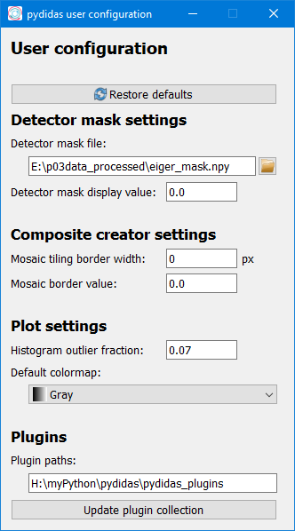

..
    This file is licensed under the
    Creative Commons Attribution 4.0 International Public License (CC-BY-4.0)
    Copyright 2023, Helmholtz-Zentrum Hereon
    SPDX-License-Identifier: CC-BY-4.0

.. _user_config_window:

The User config window
======================

The *User config window* allows the user to customize the bahaviour of their
pydidas copy. The individual Parameters are described below.

Using the :py:data:`Restore defaults` button will change all settings back to 
their default values.

Font settings
-------------

The font size and font family can be selected with the respective controls.
These settings are global for the full pydidas user interface. Font sizes 
between 5 and 20 points are supported.

The selection of fonts relies on the available system fonts. All TrueType 
scalable systems fonts are also available in pydidas.

The pydidas user interface will rescale itself based on the font metrics of 
the selection font size & family configuration. Selecting larger fonts will
grow all widgets and allows to rescale for high-DPI displays.

Settings
--------

.. list-table::
    :widths: 25 75
    :header-rows: 1
    :class: tight-table
    
    * - Parameter 
      - Description
    * - Mosaic tiling border width
      - The width (in pixels) of the border between adjacent images in 
        composites.
    * - Mosaic border value
      - The value to be assigned to the pixels on the border between adjacent
        images.
    * - Histogram outlier fraction
      - [This setting is for 2D image displays only]. This Parameter defines
        which portion of the histogram should be ignored when defining the 
        upper limit for the colormap. The default value of 0.07 means that the
        top 7% of the histogram will be ignored for setting the colormap. The 
        default value was selected to cover all pixels in module gaps for an
        Eiger 9M detector.
    * - Default colormap
      - The default colormap to be used for displaying 2D datasets. The 
        colormap can still be changed in each individual data window but those
        changes are not persistent.

Plugins
-------

The *Plugin paths* allows to modify the path where pydidas plugins are located
or to add additional paths, for example for custom plugins. **Entries must be 
separated by a double semicolor ";;".**
        
Changes to the plugin path will only take effect after using the 
:py:data:`Update plugin collection` button.

.. note:
    
    Updating the plugin collection will also clear any WorkflowTree currently
    defined / in use.