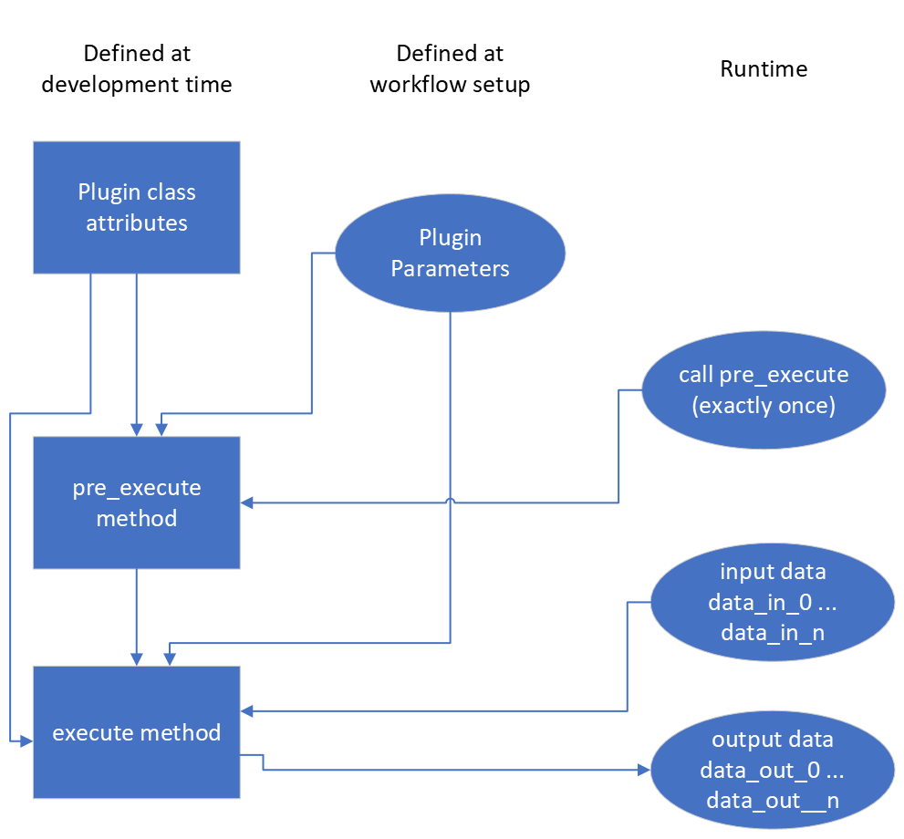

..
    This file is licensed under the
    Creative Commons Attribution 4.0 International Public License (CC-BY-4.0)
    Copyright 2023 - 2024, Helmholtz-Zentrum Hereon
    SPDX-License-Identifier: CC-BY-4.0

.. |dataset| replace:: :py:class:`Dataset <pydidas.core.Dataset>`
.. |input_plugins| replace:: :py:class:`InputPlugins <pydidas.plugins.InputPlugin>`
.. |proc_plugins| replace:: :py:class:`ProcPlugins <pydidas.plugins.ProcPlugin>`
.. |output_plugins| replace:: :py:class:`OutputPlugins <pydidas.plugins.OutputPlugin>`
.. |parameter| replace:: :py:class:`Parameter <pydidas.core.Parameter>`
.. |pre_execute| replace:: :py:meth:`pre_execute <pydidas.plugins.BasePlugin.pre_execute>`
.. |execute| replace:: :py:meth:`execute <pydidas.plugins.BasePlugin.execute>`
.. |constants| replace:: :py:mod:`pydidas.core.constants`
.. |param_collection| replace:: :py:class:`ParameterCollection <pydidas.core.ParameterCollection>`
.. |plugin_collection| replace:: :py:class:`PluginCollection <pydidas.plugins.plugin_registry.PluginRegistry>`
.. |base_plugin| replace:: :py:class:`BasePlugin <pydidas.plugins.BasePlugin>`
.. |process_multi_dim| replace:: :py:func:`process_1d_with_multi_input_dims <pydidas.core.utils.process_1d_with_multi_input_dims>`

.. _developer_guide_to_plugins:

Developers guide to pydidas Plugins
===================================

.. contents::
    :depth: 2
    :local:

Pydidas plugins are separated into three categories:

- |input_plugins| are used to load data from the filesystem.
- |proc_plugins| (short for ProcessingPlugins) are used for processing data. They 
  ingest a |dataset| and return a |dataset|. |proc_plugins| can either modify the
  input data
  or create new data.
- |output_plugins| can be used to export additional data or data in specific formats.
  Usually, data export is handled through the generic infrastructure and need not be
  handled py plugins.

All pydidas plugins must inherit from one these base classes to be discoverable:
Pydidas searches for plugins automatically in the custom plugin paths.

.. tip::

    These custom plugin path can be modified by the user (please see
    :ref:`pydidas_qsettings` for a guide on how to update the ``user/plugin_path``
    manually or use the :ref:`user_config_window` to update the paths in the GUI).

    Multiple paths need to be separated by a double semicolon "**;;**".

Plugin structure
----------------

Plugins include a number of class attributes for permanent configuration (which will be
discussed in detail later) and uses the |parameter| class to handle dynamic
configurations.

The two main methods are the |pre_execute| which is called once at the start of
processing and which can handle computationally expensive tasks which need to be
performed once. The |execute| method is called repeatedly with the processing data
and ingests one input |dataset| and returns one |dataset|. The figure below shows a
sketch.

    The simplified Plugin processing diagram. The |execute| data processing method
    can be called as often as necessary while the |pre_execute| method will be called
    exactly once.

Plugin class attributes
-----------------------

The following class attributes are used by pydidas to define the generic behaviour of
the plugin.

.. list-table::
    :widths: 25 10 65
    :header-rows: 1
    :class: tight-table

    * - class attribute
      - type
      - description
    * - :py:data:`basic_plugin`
      - bool
      - A keyword to mark basic plugin classes. For all custom plugins, this must be
        set to ``False``.
    * - :py:data:`plugin_type`
      - int
      - A key to discriminate between the different types of plugins (input,
        processing, output). Please use one of
        ``INPUT_PLUGIN, PROC_PLUGIN, OUTPUT_PLUGIN`` which can be imported from
        |constants|.
    * - :py:data:`plugin_subtype`
      - int
      - Processing plugins are further differentiated into plugins for generic data,
        image data or for integrated data. This differentiation is just for plugin
        organisation to simplify finding plugins for users. Leave this field empty
        for |input_plugins| or |output_plugins|. The ``PROC_PLUGIN_GENERIC``,
        ``PROC_PLUGIN_IMAGE``, and ``PROC_PLUGIN_INTEGRATED`` constants can be imported
        from the |constants| module.
    * - :py:data:`plugin_name`
      - str
      - The plugin name key in human-readable form for referencing the plugin. Usually,
        this should be similar to the class name but with inserted spaces and correct
        capitalization.
    * - :py:data:`default_params`
      - |param_collection|
      - A ParameterCollection with the class parameters which are required to use the
        plugin. The default is an empty |param_collection|.
    * - :py:data:`input_data_dim`
      - int
      - The dimensionality of the input data. Use -1 for arbitrary dimensionality.
        The default is -1.
    * - :py:data:`output_data_dim`
      - int
      - The dimensionality of the output data. Use -1 for arbitrary dimensionality.
        The default is -1.
    * - :py:data:`output_data_label`
      - str
      - The data label for the output |dataset|. The default is an empty string.
    * - :py:data:`output_data_unit`
      - str
      - The data unit of the output |dataset|. The default is an empty string.
    * - :py:data:`new_dataset`
      - bool
      - Keyword that the Plugin creates a new |dataset|. The default is False.
    * - :py:data:`advanced_parameters`
      - list[str, ...]
      - A list with the keys of "advanced parameters". These Parameters are hidden in
        the plugin's Parameter configuration widget be default and can be accessed
        through the associated button for "advances parameters" not to overwhelm
        users with too many options. The default is an empty list [].

:ref:`(go back to top of the page) <developer_guide_to_plugins>`

Generic plugin attributes and methods
-------------------------------------

This section describes the generic attributes and plugin methods and classmethods
which all plugins inherit and use.

Generic attributes
^^^^^^^^^^^^^^^^^^

Plugins have a number of attributes which are used to store and modify the plugin's
state. The following attributes are used by all plugins:

 - :py:data:`_config` (type: :py:data:`dict`):
    The plugin's configuration dictionary. This dictionary is used to store all
    plugin-specific data which is not stored in the Parameters. Using a dictionary
    allows to easily copy the plugin and its configuration without needing to consider
    which attributes must be copied.
 - :py:data:`node_id` (type: :py:data:`int`):
    The plugin's unique node ID. This ID is used to identify the plugin in the
    workflow.
 - :py:data:`params` (type: |param_collection|):
    The plugin's ParameterCollection. This collection is used to store all the
    plugin's Parameters.

:ref:`(go back to top of the page) <developer_guide_to_plugins>`

Plugin classmethods
^^^^^^^^^^^^^^^^^^^

Multiple class methods have been defined for the basic plugin to manage the
representation of the plugin class in the |plugin_collection|. For details, please
refer to the API documentation of the |base_plugin|.

Generic properties
^^^^^^^^^^^^^^^^^^

The following properties are used to access the plugin's configuration. **Note that
there are no setter methods defined for these properties.**

 - :py:data:`input_data` (type: :py:data:`Union[int, Dataset`]):
    The stored input data. Note that the input data is only available after it
    has been stored by the
    :py:meth`store_input_data_copy <pydidas.plugins.BasePlugin.store_input_data_copy`
    method.
 - :py:data:`result_data_label` (type: :py:data:`str`):
    The data label for the output |dataset|. This property gives a formatted string
    including the output data unit.
 - :py:data:`result_title` (type: :py:data:`str`):
    The plugin's title. This property gives a formatted string including the plugin
    name and the node ID.
 - :py:data:`input_shape` (type: :py:data:`tuple`):
    The shape of the input data. This property also has a setter method and will
    usually be called by the parent plugin (i.e. the plugin which precedes the current
    plugin in the workflow) to set the input shape.
 - :py:data:`result_shape` (type: :py:data:`tuple`):
    The shape of the output data. This property will be updated by the
    :py:meth:`calculate_result_shape <pydidas.plugins.BasePlugin.calculate_result_shape>`
    method either based on the plugin configuration or on the input data.

:ref:`(go back to top of the page) <developer_guide_to_plugins>`

Generic methods
^^^^^^^^^^^^^^^

The following generic methods are defined and used by all plugins. The default behaviour
is described as well to know when to overload these methods.

 - |pre_execute|: Please see the description above.
 - |execute|: Please see the description above.
 - :py:meth:`get_parameter_config_widget <pydidas.plugins.BasePlugin.get_parameter_config_widget>`:
    This method returns a widget instance for the plugin's parameter configuration.
    The default implementation raises a :py:data:`NotImplementedError`. This method is
    only used if the class attribute :py:data:`has_unique_parameter_config_widget` is
    set to :py:data:`True`. The plugin is responsible for passing itself / its
    |parameter| objects to the :py:class:`QWidget` instance.
 - :py:meth:`store_input_data_copy <pydidas.plugins.BasePlugin.store_input_data_copy>`:
    This method stores a copy of the input data and input kwargs in the plugin. This
    might be required, for example, to use the input data later, for example when
    calculating intermediate results.
 - :py:meth:`calculate_result_shape <pydidas.plugins.BasePlugin.calculate_result_shape>`:
    This method calculates the shape of the output data. Plugins can implement their
    own logic to calculate the output shape based. The default implementation
    returns the input shape.
 - :py:meth:`apply_legacy_image_ops_to_data <pydidas.plugins.BasePlugin.apply_legacy_image_ops_to_data>`:
    This method allows to apply legacy image operations to the method's input data.
    This method will know all binning and cropping operations from the plugin's
    ancestors and will calculate a single binning and cropping operation and apply
    it to the calling argument data :py:data:`np.ndarray`. This is useful to
    synchronize, for example, the shape of correction data like flat fields with the
    input data shape without needing to know about cropping or binning or raw data
    explicitly.

:ref:`(go back to top of the page) <developer_guide_to_plugins>`

.. _defining_plugin_parameters:

Defining plugin Parameters
--------------------------

The plugin's |param_collection| with access to all |parameter| objects is defined in
the :py:data:`default_params` class attribute. The type of the :py:data:`default_params`
attribute is a |param_collection|.
A number of generic parameters is defined in the :py:mod:`pydidas.core.generic_params` module.
A generic |parameter| can be created by using the
:py:func:`get_generic_parameter <pydidas.core.get_generic_parameter` function, for
example ``get_generic_parameter("filename")``.
Multiple generic |parameter| objects can be created at once by using the
:py:func:`get_generic_param_collection <pydidas.core.get_generic_param_collection`
function.

It is worth noting that each plugin instance, will be initialized with a copy of the
:py:data:`default_params` |param_collection|. Therefore, plugins do not share
any |parameter| objects with other plugins.

For further examples of how to define the :py:data:`default_params`, please have a
look at the :ref:`plugin_default_params_examples`.

:ref:`(go back to top of the page) <developer_guide_to_plugins>`

.. _handle_dynamic_data_dimensionality:

Handling dynamic data dimensionality
------------------------------------

Some plugins should always handle 1-dimensional data but can be supplied
with multi-dimensional input data. For example, a plugin can be designed to work with
an integrated azimuthal line profile, but should also work with a series of line
profiles which are generated from a two-dimensional integration.

Pydidas provides a mechanism to handle this situation by using the |process_multi_dim|
decorator on the |execute| method. This decorator will requires the :py:data:`process_data_dim`
|parameter| which is defined in the generic parameters.

The |process_multi_dim| decorator will automatically handle all necessary steps and the
|execute| method must be written as if it handled 1-dimensional data only.

Please see the :ref:`examples_handle_dynamic_data_dimensionality` for further details.

:ref:`(go back to top of the page) <developer_guide_to_plugins>`

Intermediate and detailed results
---------------------------------

Examples
--------

.. _plugin_default_params_examples:

Plugin default parameter definition examples
^^^^^^^^^^^^^^^^^^^^^^^^^^^^^^^^^^^^^^^^^^^^

Example 1: A plugin with a only generic |parameter| objects
~~~~~~~~~~~~~~~~~~~~~~~~~~~~~~~~~~~~~~~~~~~~~~~~~~~~~~~~~~~

The following example shows an incomplete class definition of a plugin with only
four generic |parameter| objects.

.. code-block::

    from pydidas.core.generic_params import get_generic_param_collection

    class MyPlugin(BasePlugin):

        default_params = get_generic_param_collection(
            "filename",
            "threshold_low",
            "threshold_high",
            "multiplicator",
        )

.. raw:: html

    

    <a href="#defining-plugin-parameters">Back to "Defining plugin Parameters" section</a>
    <a href="#developer-guide-to-plugins">(go back to top of the page)</a>
    
  

Example 2: A plugin with a mix of generic and custom |parameter| objects
~~~~~~~~~~~~~~~~~~~~~~~~~~~~~~~~~~~~~~~~~~~~~~~~~~~~~~~~~~~~~~~~~~~~~~~~

The following example shows an incomplete class definition of a plugin with a mix
of generic and custom |parameter| objects.

.. code-block::

    from pydidas.core import Parameter
    from pydidas.core.generic_params import get_generic_param_collection

    offset_param = Parameter(
        "offset",
        float,
        0,
        name="Data offset",
        tooltip="A constant data offset which is applied to the input data.",
    )

    class MyPlugin(BasePlugin):

        default_params = get_generic_param_collection(
            "filename",
            "threshold_low",
            "threshold_high",
        )
        default_params.add_param(offset_param)

.. raw:: html

    

    <a href="#defining-plugin-parameters">Back to "Defining plugin Parameters" section</a>
    <a href="#developer-guide-to-plugins">(go back to top of the page)</a>
    
  

Example 3: A plugin with mostly custom |parameter| objects
~~~~~~~~~~~~~~~~~~~~~~~~~~~~~~~~~~~~~~~~~~~~~~~~~~~~~~~~~~

The following example shows an incomplete class definition of a plugin with
|param_collection| including generic and custom |parameter| objects defined outside
the plugin.

.. code-block::

    from pydidas.core import Parameter, ParameterCollection
    from pydidas.core.generic_params import get_generic_parameter

    class MyPlugin(BasePlugin):

        default_params = ParameterCollection(
            Parameter(
                "offset",
                float,
                0,
                name="Data offset",
                tooltip="A constant data offset which is applied to the input data.",
            ),
            Parameter(
                "noise",
                float,
                0,
                name="Random noise level",
                tooltip="The random noise level which is added to each input data point.",
            ),
            get_generic_parameter("filename"),
        )

.. raw:: html

    

    <a href="#defining-plugin-parameters">Back to "Defining plugin Parameters" section</a>
    <a href="#developer-guide-to-plugins">(go back to top of the page)</a>
    
  

.. _examples_handle_dynamic_data_dimensionality:

Handling dynamic data dimensionality example
--------------------------------------------

This example shows a fully functional plugin which can handle multi-dimensional input.
The plugin

.. raw:: html

    

    <a href="#handle-dynamic-data-dimensionality">Back to "Handling dynamic data dimensionality" section</a>
    <a href="#developer-guide-to-plugins">(go back to top of the page)</a>
    
  