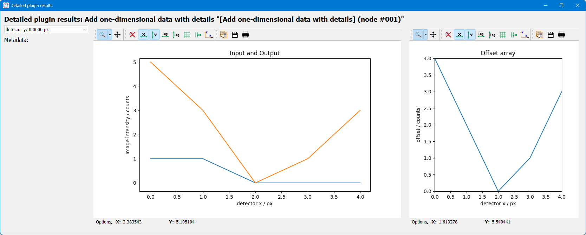

..
    This file is licensed under the
    Creative Commons Attribution 4.0 International Public License (CC-BY-4.0)
    Copyright 2023 - 2025, Helmholtz-Zentrum Hereon
    SPDX-License-Identifier: CC-BY-4.0

.. |dataset| replace:: :py:class:`Dataset <pydidas.core.Dataset>`
.. |input_plugin| replace:: :py:class:`InputPlugin <pydidas.plugins.InputPlugin>`
.. |input_plugins| replace:: :py:class:`InputPlugins <pydidas.plugins.InputPlugin>`
.. |proc_plugin| replace:: :py:class:`ProcPlugin <pydidas.plugins.ProcPlugin>`
.. |proc_plugins| replace:: :py:class:`ProcPlugins <pydidas.plugins.ProcPlugin>`
.. |output_plugin| replace:: :py:class:`OutputPlugin <pydidas.plugins.OutputPlugin>`
.. |output_plugins| replace:: :py:class:`OutputPlugins <pydidas.plugins.OutputPlugin>`
.. |parameter| replace:: :py:class:`Parameter <pydidas.core.Parameter>`
.. |pre_execute| replace:: :py:meth:`pre_execute <pydidas.plugins.BasePlugin.pre_execute>`
.. |execute| replace:: :py:meth:`execute <pydidas.plugins.BasePlugin.execute>`
.. |constants| replace:: :py:mod:`pydidas.core.constants`
.. |param_collection| replace:: :py:class:`ParameterCollection <pydidas.core.ParameterCollection>`
.. |plugin_collection| replace:: :py:class:`PluginCollection <pydidas.plugins.plugin_registry.PluginRegistry>`
.. |base_plugin| replace:: :py:class:`BasePlugin <pydidas.plugins.BasePlugin>`
.. |process_multi_dim| replace:: :py:func:`process_1d_with_multi_input_dims <pydidas.core.utils.process_1d_with_multi_input_dims>`
.. |workflow_tree| replace:: :py:class:`WorkflowTree <pydidas.workflow.ProcessingTree>`

.. _developer_guide_to_plugins:

Developers guide to pydidas Plugins
===================================

.. contents::
    :depth: 2
    :local:

Pydidas plugins are separated into three categories:

- |input_plugins| are used to load data from the filesystem.
- |proc_plugins| (short for ProcessingPlugins) are used for processing data. They 
  ingest a |dataset| and return a |dataset|. |proc_plugins| can either modify the
  input data
  or create new data.
- |output_plugins| can be used to export additional data or data in specific formats.
  Usually, data export is handled through the generic infrastructure and need not be
  handled py plugins.

All pydidas plugins must inherit from one these base classes to be discoverable:
Pydidas searches for plugins automatically in the custom plugin paths.

.. tip::

    These custom plugin path can be modified by the user (please see
    :ref:`pydidas_qsettings` for a guide on how to update the ``user/plugin_path``
    manually or use the :ref:`user_config_window` to update the paths in the GUI).

    Multiple paths need to be separated by a double semicolon "**;;**".

Plugin structure
----------------

Plugins include a number of class attributes for permanent configuration (which will be
discussed in detail later) and uses the |parameter| class to handle dynamic
configurations.

The two main methods are the |pre_execute| which is called once at the start of
processing and which can handle computationally expensive tasks which need to be
performed once. The |execute| method is called repeatedly with the processing data
and ingests one input |dataset| and returns one |dataset|. The figure below shows a
sketch.

.. figure:: images/plugin_processing_diagram.png
    :width: 495 px
    :align: center

    The simplified Plugin processing diagram. The |execute| data processing method
    can be called as often as necessary while the |pre_execute| method will be called
    exactly once.

Plugin class attributes
-----------------------

The following class attributes are used by pydidas to define the generic behaviour of
the plugin.

.. list-table::
    :widths: 25 10 65
    :header-rows: 1
    :class: tight-table

    * - class attribute
      - type
      - description
    * - :py:data:`plugin_type`
      - int
      - A key to discriminate between the different types of plugins (input,
        processing, output). Please use one of
        ``INPUT_PLUGIN, PROC_PLUGIN, OUTPUT_PLUGIN`` which can be imported from
        |constants|. Typically, this attribute should be set by inheriting from the
        |input_plugin|, |proc_plugin|, or |output_plugin| classes.
    * - :py:data:`plugin_subtype`
      - int
      - Processing plugins are further differentiated into plugins for generic data,
        image data or for integrated data. This differentiation is just for plugin
        organisation to simplify finding plugins for users. Leave this field empty
        for |input_plugins| or |output_plugins|. The ``PROC_PLUGIN_GENERIC``,
        ``PROC_PLUGIN_IMAGE``, and ``PROC_PLUGIN_INTEGRATED`` constants can be imported
        from the |constants| module.
    * - :py:data:`plugin_name`
      - str
      - The plugin name key in human-readable form for referencing the plugin. Usually,
        this should be similar to the class name but with inserted spaces and correct
        capitalization.
    * - :py:data:`default_params`
      - |param_collection|
      - A ParameterCollection with the class parameters which are required to use the
        plugin. The default is an empty |param_collection|.
    * - :py:data:`input_data_dim`
      - int
      - The dimensionality of the input data. Use -1 for arbitrary dimensionality.
        The default is -1.
    * - :py:data:`output_data_dim`
      - int
      - The dimensionality of the output data. Use -1 for arbitrary dimensionality.
        The default is -1.
    * - :py:data:`output_data_label`
      - str
      - The data label for the output |dataset|. The default is an empty string.
    * - :py:data:`output_data_unit`
      - str
      - The data unit of the output |dataset|. The default is an empty string.
    * - :py:data:`new_dataset`
      - bool
      - Keyword that the Plugin creates a new |dataset|. The default is False.
    * - :py:data:`advanced_parameters`
      - list[str, ...]
      - A list with the keys of "advanced parameters". These Parameters are hidden in
        the plugin's Parameter configuration widget be default and can be accessed
        through the associated button for "advances parameters" not to overwhelm
        users with too many options. The default is an empty list [].

:ref:`(go back to top of the page) <developer_guide_to_plugins>`

Generic plugin attributes and methods
-------------------------------------

This section describes the generic attributes and plugin methods and classmethods
which all plugins inherit and use.

Generic attributes
^^^^^^^^^^^^^^^^^^

Plugins have a number of attributes which are used to store and modify the plugin's
state. The following attributes are used by all plugins:

 - :py:data:`_config` (type: :py:data:`dict`):
    The plugin's configuration dictionary. This dictionary is used to store all
    plugin-specific data which is not stored in the Parameters. Using a dictionary
    allows to easily copy the plugin and its configuration without needing to consider
    which attributes must be copied.
 - :py:data:`node_id` (type: :py:data:`int`):
    The plugin's unique node ID. This ID is used to identify the plugin in the
    workflow.
 - :py:data:`params` (type: |param_collection|):
    The plugin's ParameterCollection. This collection is used to store all the
    plugin's Parameters.

:ref:`(go back to top of the page) <developer_guide_to_plugins>`

Plugin classmethods
^^^^^^^^^^^^^^^^^^^

Multiple class methods have been defined for the basic plugin to manage the
representation of the plugin class in the |plugin_collection|. For details, please
refer to the API documentation of the |base_plugin|.

Generic properties
^^^^^^^^^^^^^^^^^^

The following properties are used to access the plugin's configuration. **Note that
there are no setter methods defined for these properties.**

 - :py:data:`input_data` (type: :py:data:`Union[int, Dataset`]):
    The stored input data. Note that the input data is only available after it
    has been stored by the
    :py:meth`store_input_data_copy <pydidas.plugins.BasePlugin.store_input_data_copy`
    method.
 - :py:data:`result_data_label` (type: :py:data:`str`):
    The data label for the output |dataset|. This property gives a formatted string
    including the output data unit.
 - :py:data:`result_title` (type: :py:data:`str`):
    The plugin's title. This property gives a formatted string including the plugin
    name and the node ID.

:ref:`(go back to top of the page) <developer_guide_to_plugins>`

Generic methods
^^^^^^^^^^^^^^^

The following generic methods are defined and used by all plugins. The default behaviour
is described as well to know when to overload these methods.

 - |pre_execute|:
    The |pre_execute| method is called once at the start of the
    processing. This method can be used to perform computationally expensive tasks
    which need to be performed once. It does not accept any arguments.
 - |execute|:
    The |execute| method is called repeatedly with the processing data.
    Required arguments are exactly one input |dataset| and the :py:data:`kwargs` input
    keyword arguments. It must also return exactly one |dataset| and the
    :py:data:`kwargs`, possibly modified by the plugin.
 - :py:meth:`get_parameter_config_widget <pydidas.plugins.BasePlugin.get_parameter_config_widget>`:
    This method returns a widget instance for the plugin's parameter configuration.
    The default implementation raises a :py:data:`NotImplementedError`. This method is
    only used if the class attribute :py:data:`has_unique_parameter_config_widget` is
    set to :py:data:`True`. The plugin is responsible for passing itself / its
    |parameter| objects to the :py:class:`QWidget` instance.
 - :py:meth:`store_input_data_copy <pydidas.plugins.BasePlugin.store_input_data_copy>`:
    This method stores a copy of the input data and input kwargs in the plugin. This
    might be required, for example, to use the input data later, for example when
    calculating intermediate results.

:ref:`(go back to top of the page) <developer_guide_to_plugins>`

.. _defining_plugin_parameters:

Defining plugin Parameters
--------------------------

The plugin's |param_collection| with access to all |parameter| objects is defined in
the :py:data:`default_params` class attribute. The type of the :py:data:`default_params`
attribute is a |param_collection|.
A number of generic parameters is defined in the :py:mod:`pydidas.core.generic_params` module.
A generic |parameter| can be created by using the
:py:func:`get_generic_parameter <pydidas.core.get_generic_parameter` function, for
example ``get_generic_parameter("filename")``.
Multiple generic |parameter| objects can be created at once by using the
:py:func:`get_generic_param_collection <pydidas.core.get_generic_param_collection`
function.

It is worth noting that each plugin instance, will be initialized with a copy of the
:py:data:`default_params` |param_collection|. Therefore, plugins do not share
any |parameter| objects with other plugins.

For further examples of how to define the :py:data:`default_params`, please have a
look at the :ref:`plugin_default_params_examples`.

Please also see :ref:`generic_params` for a complete list of all available generic
|parameter|.

:ref:`(go back to top of the page) <developer_guide_to_plugins>`

.. _handle_dynamic_data_dimensionality:

Handling dynamic data dimensionality
------------------------------------

Some plugins should always handle 1-dimensional data but can be supplied
with multi-dimensional input data. For example, a plugin can be designed to work with
an integrated azimuthal line profile, but should also work with a series of line
profiles which are generated from a two-dimensional integration.

Pydidas provides a mechanism to handle this situation by using the |process_multi_dim|
decorator on the |execute| method. This decorator will requires the
:py:data:`process_data_dim` |parameter| which is defined in the generic parameters.

The |process_multi_dim| decorator will automatically handle all necessary steps and the
|execute| method must be written as if it handled 1-dimensional data only.

Please see the :ref:`examples_handle_dynamic_data_dimensionality` for further details.

:ref:`(go back to top of the page) <developer_guide_to_plugins>`

.. _intermediate_results:

Intermediate and detailed results
---------------------------------

For some applications, it is useful for the user to have access to intermediate results
of the processing, for example for fitting or automatic classifications. The
intermediate results are used for automatic visualization and therefore require a
specific form.
Pydidas provides an automatic mechanism to access intermediate results. The plugin's
:py:data:`_details` attribute is used to store the intermediate results as a
:py:data:`dict` with a :py:data:`None` key and a :py:data:`dict` value. The
:py:data:`detailed_results_dict` details will be laid out below.

A :py:data:`detailed_results` property must also be defined to access the detailed
results.

.. code-block::

        def execute(self, data: Dataset, **kwargs: dict) -> tuple[Dataset, dict]:
            # Do some processing
            if kwargs.get("store_details", False):
                self._details = {None: detailed_results_dict}
            return data, kwargs

        @property
        def detailed_results(self) -> dict:
            return self._details

The rationale behind this is that detailed results must also be available for plugins
which allow dynamic data dimensionality. In this case, the |process_multi_dim|
decorator stores the detailed results with the correct keys and :py:data:`None` was
selected as generic key because no data will use the :py:data`None` key.

The :py:data:`detailed_results_dict` also has a defined structure. The following
keys are required:

    - :py:data:`n_plots` (type: :py:data:`int`):
        The number of plots used by this Plugin.
    - :py:data:`plot_titles` (type: :py:data:`dict`):
        A dictionary with the plot titles. The keys are the plot indices and the values
        are the plot titles. Example ``"plot_titles" : {0: "Title A", 1: "Title B"}``.
    - :py:data:`metadata` (type: :py:data:`str`):
        Additional metadata to be given to the user. The metadata must be in string
        format and if a specific formatting is required for readability, the plugin
        must provide this formatting.
    - :py:data:`items` (type: :py:data:`list[dict]`):
        A list with the individual items to be plotted. Each item must be a dictionary
        with the following keys:

            - :py:data:`plot` (type: :py:data:`int`):
                The index of the plot to which the item belongs.
            - :py:data:`label` (type: :py:data:`str`):
                The label of the plot item for the legend.
            - :py:data:`data` (type: |dataset|):
                The data to be plotted.

For an example, please see the :ref:`examples_intermediate_results`.

.. note::

    Detailed results are only available if the user has selected to store them.
    This can be by using the ``store_details=True`` keyword argument in the
    |execute| method. Because :py:data:`kwargs` are passed down through the
    |workflow_tree| to all the plugins,
    the ``store_details=True`` can be called in the :py:meth:`execute_process
    <pydidas.workflow.ProcessingTree.execute_process>` method of the |workflow_tree|.

Examples
--------

.. _plugin_default_params_examples:

Plugin default parameter definition examples
^^^^^^^^^^^^^^^^^^^^^^^^^^^^^^^^^^^^^^^^^^^^

Example 1: A plugin with a only generic |parameter| objects
~~~~~~~~~~~~~~~~~~~~~~~~~~~~~~~~~~~~~~~~~~~~~~~~~~~~~~~~~~~

The following example shows an incomplete class definition of a plugin with only
four generic |parameter| objects.

.. code-block::

    from pydidas.core.generic_params import get_generic_param_collection
    from pydidas.plugins import BasePlugin

    class MyPlugin(BasePlugin):

        default_params = get_generic_param_collection(
            "filename",
            "threshold_low",
            "threshold_high",
            "multiplicator",
        )

.. raw:: html

    

    <a href="#defining-plugin-parameters">Back to "Defining plugin Parameters" section</a>
    <a href="#developer-guide-to-plugins">(go back to top of the page)</a>
    
  

Example 2: A plugin with a mix of generic and custom |parameter| objects
~~~~~~~~~~~~~~~~~~~~~~~~~~~~~~~~~~~~~~~~~~~~~~~~~~~~~~~~~~~~~~~~~~~~~~~~

The following example shows an incomplete class definition of a plugin with a mix
of generic and custom |parameter| objects.

.. code-block::

    from pydidas.core import Parameter
    from pydidas.core.generic_params import get_generic_param_collection
    from pydidas.plugins import BasePlugin

    offset_param = Parameter(
        "offset",
        float,
        0,
        name="Data offset",
        tooltip="A constant data offset which is applied to the input data.",
    )

    class MyPlugin(BasePlugin):

        default_params = get_generic_param_collection(
            "filename",
            "threshold_low",
            "threshold_high",
        )
        default_params.add_param(offset_param)

.. raw:: html

    

    <a href="#defining-plugin-parameters">Back to "Defining plugin Parameters" section</a>
    <a href="#developer-guide-to-plugins">(go back to top of the page)</a>
    
  

Example 3: A plugin with mostly custom |parameter| objects
~~~~~~~~~~~~~~~~~~~~~~~~~~~~~~~~~~~~~~~~~~~~~~~~~~~~~~~~~~

The following example shows an incomplete class definition of a plugin with
|param_collection| including generic and custom |parameter| objects defined outside
the plugin.

.. code-block::

    from pydidas.core import Parameter, ParameterCollection
    from pydidas.core.generic_params import get_generic_parameter
    from pydidas.plugins import BasePlugin

    class MyPlugin(BasePlugin):

        default_params = ParameterCollection(
            Parameter(
                "offset",
                float,
                0,
                name="Data offset",
                tooltip="A constant data offset which is applied to the input data.",
            ),
            Parameter(
                "noise",
                float,
                0,
                name="Random noise level",
                tooltip="The random noise level which is added to each input data point.",
            ),
            get_generic_parameter("filename"),
        )

.. raw:: html

    

    <a href="#defining-plugin-parameters">Back to "Defining plugin Parameters" section</a>
    <a href="#developer-guide-to-plugins">(go back to top of the page)</a>
    
  

.. _examples_handle_dynamic_data_dimensionality:

Handling dynamic data dimensionality example
^^^^^^^^^^^^^^^^^^^^^^^^^^^^^^^^^^^^^^^^^^^^

This example shows a fully functional plugin which can handle multi-dimensional input.
The plugin adds a one-dimensional :py:class:`np.ndarray` to the input data.

.. code-block::

    import numpy as np

    from pydidas.core import (
        Dataset, Parameter, ParameterCollection, UserConfigError, get_generic_parameter
    )
    from pydidas.core.utils import process_1d_with_multi_input_dims
    from pydidas.core.constants import PROC_PLUGIN
    from pydidas.plugins import ProcPlugin

    class AddOneDimensionalData(ProcPlugin):

        default_params = ParameterCollection(
            get_generic_parameter("process_data_dim"),
            Parameter(
                "offset_array",
                np.ndarray,
                np.zeros((5)),
                name="1D offset array",
                tooltip="The offset array to be added to the 1d input data",
            ),
        )
        plugin_name = "Add one-dimensional data"
        plugin_type = PROC_PLUGIN
        basic_plugin = False
        input_data_dim = -1
        output_data_dim = -1

        @process_1d_with_multi_input_dims
        def execute(self, data: Dataset, **kwargs: dict) -> Dataset:
            _arr = self.get_param_value("offset_array")
            if data.shape != _arr.shape:
                raise UserConfigError(
                    "The offset array must have the same shape as the input data."
                )
            data += _arr
            return data, kwargs

Now, when testing the plugin with 1-dimensional data, the plugin will simple process
the input data:

.. code-block::

    >>> p = AddOneDimensionalData()
    >>> p.set_param_value("offset_array", np.arange(5))
    >>> data_1d = Dataset(np.zeros((5)
    ...     axis_ranges=[5 * np.arange(5)],
    ...     axis_labels=["x"],
    ...     axis_units=["px"],
    ...     data_label="Test data",
    ...     data_unit="a.u.",
    ...     )
    >>> new_data, _ = p.execute(data_1d)
    >>> print(new_data)
    Dataset(
    axis_labels: {
        0: 'x'},
    axis_ranges: {
        0: array([ 0, 5, 10, 15, 20])},
    axis_units: {
        0: 'px'},
    metadata: {},
    data_unit: a.u.,
    data_label: Test data,
    array([0., 1., 2., 3., 4.])
    )

When testing the plugin with multi-dimensional data, the plugin will automatically
apply the algorithm in the decorated |execute| method to one-dimensional slices of the
input data. By default, the processed dimension is the last dimension (see first part
of the example below) . When the :py:data:`process_data_dim` |parameter| is set to 0,
the first dimension will be processed (compare second part of the example).

.. code-block::

    >>> p = AddOneDimensionalData()
    >>> p.set_param_value("offset_array", np.arange(5))
    >>> data_2d = Dataset(
    ...     np.zeros((5, 5)),
    ...     axis_ranges=[5 * np.arange(5), 12 - np.arange(5)],
    ...     axis_labels=["x", "y"],
    ...     axis_units=["px", "px"],
    ...     data_label="Test data",
    ...     data_unit="a.u.",
    ... )
    >>> new_data, _ = p.execute(data_2d.copy())
    # Note: For brevity, only the numerical data of the output Dataset is printed.
    >>> print(new_data.array)
    [[0. 1. 2. 3. 4.]
     [0. 1. 2. 3. 4.]
     [0. 1. 2. 3. 4.]
     [0. 1. 2. 3. 4.]
     [0. 1. 2. 3. 4.]]
    # Now, we change the processing dimension:
    >>> p.set_param_value("process_data_dim", 0)
    >>> new_data, _ = p.execute(data_2d)
    >>> print(new_data.array)
    [[0. 0. 0. 0. 0.]
     [2. 2. 2. 2. 2.]
     [1. 1. 1. 1. 1.]
     [3. 3. 3. 3. 3.]
     [4. 4. 4. 4. 4.]]

.. note::

    The plugin modifies the input |dataset| in place. Therefore, the input dataset
    will also be changed. Copying of the data in the input is only necessary in
    this example. In a proper pydidas Workflow, the framework will automatically
    pass a copy of the input data to the plugin if the input data is passed to more
    than one plugin.

.. raw:: html

    

    <a href="#handle-dynamic-data-dimensionality">Back to "Handling dynamic data dimensionality" section</a>
    <a href="#developer-guide-to-plugins">(go back to top of the page)</a>
    
  

.. _examples_intermediate_results:

Intermediate and detailed results example
^^^^^^^^^^^^^^^^^^^^^^^^^^^^^^^^^^^^^^^^^

This example uses the :py:data:`AddOneDimensionalData` plugin from the previous example
(see :ref:`examples_handle_dynamic_data_dimensionality`) and adds functionality to
handle intermediate results.

.. code-block::

    class AddOneDimensionalDataWithDetails(AddOneDimensionalData):
        plugin_name = "Add one-dimensional data with details"

        def __init__(self):
            super().__init__()
            self._details = {}

        @property
        def detailed_results(self) -> dict:
            return self._details

        @process_1d_with_multi_input_dims
        def execute(self, data: Dataset, **kwargs: dict) -> tuple[Dataset, dict]:
            self.store_input_data_copy(data)
            new_data, kwargs = AddOneDimensionalData.execute(self, data, **kwargs)
            if kwargs.get("store_details", False):
                self._details = {None: self._create_detailed_results(data, new_data)}
            return new_data, kwargs

        def _create_detailed_results(self, output: Dataset) -> dict:
            return {
                "n_plots": 2,
                "plot_titles": {0: "Input and Output", 1: "Offset array"},
                "plot_ylabels": {
                    0: "intensity / a.u.",
                    1: "intensity / a.u.",
                },
                "metadata": "",
                "items": [
                    {"plot": 0, "label": "input data", "data": self.input_data},
                    {"plot": 0, "label": "output data", "data": output},
                    {
                        "plot": 1,
                        "label": "offset",
                        "data": Dataset(self.get_param_value("offset_array"))
                    },
                ],
            }

Now, when testing the plugin, the detailed results can be accessed through the
:py:data:`detailed_results` property or automatically in the :ref:`workflow_test_frame`
when using the GUI.

As example, the following code snippet shows how to access the detailed results, first
for a one-dimensional input |dataset|, then for a two-dimensional input |dataset|.

.. code-block::

    >>> p = AddOneDimensionalDataWithDetails()
    >>> p.set_param_value("offset_array", np.array((4, 2, 0, 1, 3)))
    >>> data_1d = Dataset(np.array((1, 1, 0, 0, 0)), axis_labels=["x"])
    >>> data_2d = Dataset(
    ...     np.tile(np.array((1, 1, 0, 0, 0)), (5, 1)),
    ...     axis_labels=["x", "y"],
    ... )

    # First, we test the plugin with a one-dimensional input Dataset:
    >>> new_data_1d, _ = p.execute(data_1d.copy(), store_details=True)
    >>> (new_data_1d - data_1d).array
    array([4, 2, 0, 1, 3])
    # Detailed results will now be stored using the generic key `None`:
    >>> p.detailed_results.keys()
    dict_keys([None])
    >>> p.detailed_results[None].keys()
    dict_keys(['n_plots', 'plot_titles', 'plot_ylabels', 'metadata', 'items'])

    # Now, we test the plugin with a two-dimensional input Dataset:
    >>> new_data, _ = p.execute(data_2d.copy(), store_details=True)
    >>> (new_data - data_2d).array
    array([[4., 2., 0., 1., 3.],
           [4., 2., 0., 1., 3.],
           [4., 2., 0., 1., 3.],
           [4., 2., 0., 1., 3.],
           [4., 2., 0., 1., 3.]])
    >>> p.detailed_results.keys()
    dict_keys(['x: 0.0000 ', 'x: 1.0000 ', 'x: 2.0000 ', 'x: 3.0000 ', 'x: 4.0000 '])

The representation in the GUI looks like the following:

|

.. raw:: html

    

    <a href="#intermediate-results">Back to "Intermediate and detailed results" section</a>
    <a href="#developer-guide-to-plugins">(go back to top of the page)</a>
    
  

