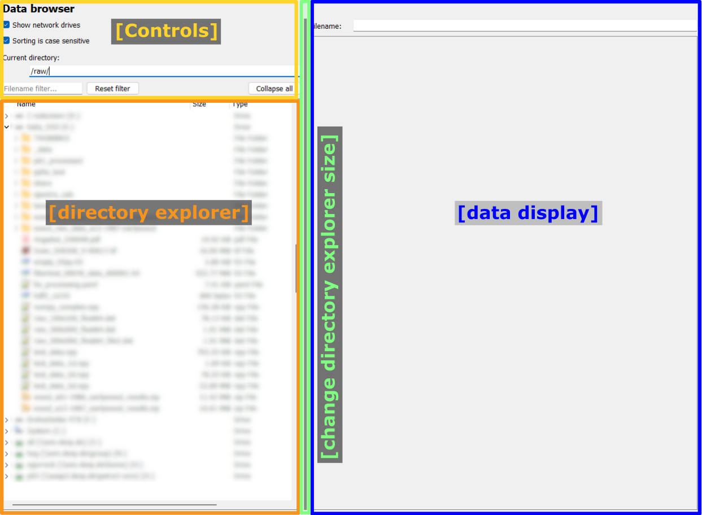
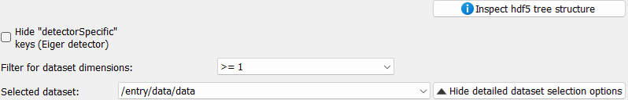
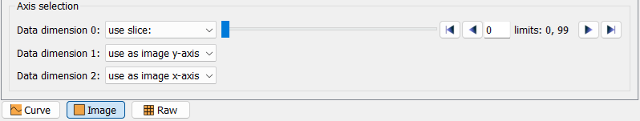

..
    This file is licensed under the
    Creative Commons Attribution 4.0 International Public License (CC-BY-4.0)
    Copyright 2023 - 2025, Helmholtz-Zentrum Hereon
    SPDX-License-Identifier: CC-BY-4.0

.. _data_browsing_frame:

Data browsing frame
===================

.. contents::
    :depth: 2
    :local:
    :backlinks: none
    
The data browsing frame allows the visualization of one-dimensional and
two-dimensional data. The frame is divided in two main parts: On the left, a
directory explorer allows to browse the full file system and select files.
On the right side, a data display allows to visualize data.

**Files are selected by double-clicking on the respective file in the directory.**
For raw images, an additional selection widget to specify the data settings will be
shown. Similarly, for hdf5 files, an additional selection widget to select the
dataset in the file will be shown.

In the screenshot above, the data display is empty as no data has been selected. An
example will be shown in the following sections.

The width of the directory explorer widget can be adjusted by using the dark grey
handle between the two main widgets, to reduce or to enlarge the
directory explorer, respectively. The draggable handle is highlighted with the
green frame in the screenshot above.

.. warning::

    The two main widgets have a defined minimum size. If the user drags the 
    splitter further, the respective widget will be hidden. It can be enlarged
    again by capturing and dragging the dark slider from the edge towards the center.
    
Controls
^^^^^^^^

The controls are located on the left, above the directory explorer.
Selecting or deselecting an option will directly update the directory explorer.

The options are:

  - Show network drives
  
    This option allows to show or hide linked network drives in the explorer
    view.
    
  - Sorting is case sensitive
  
    This option toggles case sensitive sorting. If enabled, lowercase and 
    uppercase names will be sorted and displayed separately.

Directory explorer
^^^^^^^^^^^^^^^^^^

The directory explorer is used to select the data to be displayed. The exact
look and feel will depend on the used operating system and might be different
from the screenshots shown here.

A single click on an item will just highlight the item but will otherwise be 
ignored. Double-clicking on a folder (or the arrow next to a folder) will 
expand or collapse the folder, depending on the folder's current state. 
Double-clicking on a file will instruct pydidas to open the selected file. If 
the data format is readable and the file contains two-dimensional data, the 
content will be displayed in the ImageView widget. In case of hdf5 files, an
additional selection field will be shown to select the data frame.

Data display
^^^^^^^^^^^^

The data display widget is shown on the right with the default 2D image view for
multi-dimensional data.

Key elements are:

  - The filename display at the top:  This widget shows the full path of the opened file.
  - Selection widgets for raw images and hdf5 files: These widgets allow to select the
    data settings for raw images and the dataset for hdf5 files.
  - The visualization widget: The selected data is displayed here.
  - The slice selection widget: Select the slicing in multi-dimensional datasets to
    select a two-dimensional slice for visualization.
  - The display modality selection: Select how to display the data.

.. image:: images/data_browse/display.png
    :align: right
    :width: 300px

Details for all elements are given below.

.. note::

    The data display cannot process any metadata like axis labels or ranges. Only
    the raw data is displayed and only indices can be used to select.

|
|
|

The hdf5 data selection widget
""""""""""""""""""""""""""""""

The hdf5 data selection widget is shown below.

.. image:: images/data_browse/hdf5_small.png
    :align: center

In the minimized view, it allows to open a window to display the hdf5 file structure
(:ref:`hdf5_browser_window`), and a combo box to select the dataset to display.
An additional button allows to show more dataset filter options. The full widget with
all filter options is shown below:

The first row allows the user to select dataset filters for specific names.
For example, the Eiger detector master file has a number of datasets for 
detector specific settings like offsets and calibrations for the different 
modules. If the respective box is ticked, these datasets will not be shown in 
the drop-down list. Additional filters for datasets can be set on their and minimum
data dimension. Any changes to the filters will update the list of filtered datasets
immediately.

To select a dataset, simply select the corresponding hdf5 dataset key from the drop-down
list of the combo box. This will update the selection of the data frame.

Browsing multi-dimensional datasets uses the slice selection widget, which will be
explained below.

The raw data selection widget
"""""""""""""""""""""""""""""

Importing raw data files requires an additional selection of data type, image shape
and header length (the header length is given in bytes). Settings all these values
allows to correctly decode raw images. The respective widget is shown below:

Trying to decode raw data with wrong settings raises a warning message if the data
cannot be imported.

A checkbox with *Automatically load files with these settings* allows to automatically
apply these settings to a series of files with the same settings.

The *Hide detailed options* button allows to minimize the widget to a minimal size to
increase the available space for the data display.

Display modality and slice selection
""""""""""""""""""""""""""""""""""""

At the bottom of the data display widget, the display modality and slice selection
widgets allow to define how the data is displayed and which slice is shown.

An exemplary view is shown below:

Depending on the data dimensionality, the modality selection will show different
options:

 - Curve: Display a one-dimensional slice of the data as a line plot.
 - Image: Display a two-dimensional slice of the data as an image.
 - Raw: Display the raw data as a table.

The axis selection is required to specify which information to plot. For a curve view,
one data dimension can be specified as *curve y*. The other axes will show a *use slice*
option and a slider to select the slice to be plotted.
For an image view, two axes can be selected to *use as image y-axis* and
*use as image x-axis*, respectively. The other axes will show a *use slice* option and
a slider. Similarly, for the raw view, two axes can be selected to *use as row* and
*use as column*, respectively.

2D image view
"""""""""""""

.. include:: ../silx/plot2d_general.rst

Menu icon descriptions
~~~~~~~~~~~~~~~~~~~~~~

The following functionality is available through the toolbar icons:

.. include:: ../silx/plot2d_icons.rst

