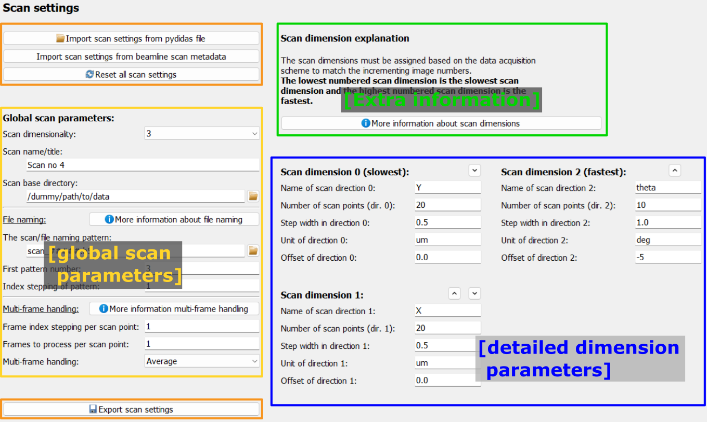
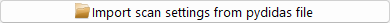
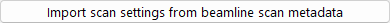
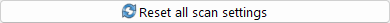
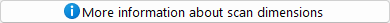
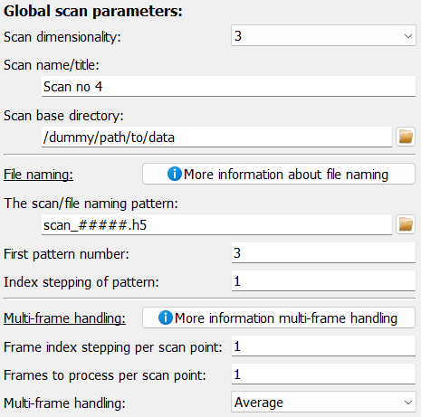

..
    This file is licensed under the
    Creative Commons Attribution 4.0 International Public License (CC-BY-4.0)
    Copyright 2024 - 2025, Helmholtz-Zentrum Hereon
    SPDX-License-Identifier: CC-BY-4.0

.. _define_scan_frame:

Define scan frame
=================

.. contents::
    :depth: 2
    :local:
    :backlinks: none

The *Scan setup* frame is a graphical interface to configure the 
:py:class:`ScanContext <pydidas.contexts.scan.Scan>` 
which holds information about the scan setup. 

The frame only holds the configuration widgets for its Parameters as well as 
some buttons for convenience functionality.

Control buttons
---------------

Import scan settings
^^^^^^^^^^^^^^^^^^^^

|

The Scan settings can be imported from files written by pydidas. Clicking the
corresponding button will open a selection dialogue to pick the file with the
stored settings. File extensions will be pre-selected based on the available
importers.

Import scan settings from beamline metadata files
^^^^^^^^^^^^^^^^^^^^^^^^^^^^^^^^^^^^^^^^^^^^^^^^^

|

A second option for importing scan settings is to use beamline metadata files.
These files are created by beamline software and contain information about the
scan setup. The button will open a file selection dialogue to pick the file with
the stored settings. File extensions will be pre-selected based on the available
importers.

If you are unsure how to proceed for your specific beamline metadata files,
please discuss with your local beamline support.

If you are missing a specific beamline metadata importer, please contact the
development team by raising a
`GitHub issue <https://github.com/hereon-GEMS/pydidas/issues>`_.

Reset Parameters
^^^^^^^^^^^^^^^^

|

The "Reset all scan settings" button allows the user to change all Parameters
back to their default values. 

Export scan settings
^^^^^^^^^^^^^^^^^^^^

.. image:: images/scan/export.png
    :align: left

|

At the bottom of the Frame, the export button allows users to export the current
:py:class:`ScanContext <pydidas.contexts.scan.Scan>` 
Parameters to a file. This button will open a filename dialogue.

Scan dimension explanation
--------------------------

|

The scan dimension explanation section gives detailed information about the 
ordering of scan scan dimensions. The *slowest* scan dimension is dimension no. 
0 and the fastest is the last scan dimension. This ordering corresponds to how
the scan must be performed algorithmically. The button opens a window with an
in-depth explanation, including images.

Global Parameters
-----------------

Here, *global* refers to general scan Parameters in contrast to Parameters for 
a specific scan dimension. The scan dimensionality defines the number of used
dimensions (and also shows or hides the corresponding widgets for the selected
dimensions). The scan title is used as reference in titles and captions.

The base directory and scan name pattern are used for :py:class:`InputPlugins
<pydidas.plugins.InputPlugin>` to define the raw data source. The starting index
defines the number of the first data file.

For a detailed description of each Parameter, please refer to the 
:ref:`list of ScanContext Parameters <scan_context_params>` found at the bottom of 
this page.

Configuring a scan dimension
----------------------------

.. note::
    Following the python nomenclature, the first index is 0 (zero) and so forth.

.. image:: images/scan/dimension.png
    :align: left

The configuration for each scan dimension is the same, and dimension #1 is shown
only exemplarily. 

At the top, next to the name, are two small buttons with up and down arrows 
which allow to move the given scan dimension up or down in the list to change
the order. Only reasonable arrows are shown, for example the first scan 
dimension cannot be further moved upwards. 

Each scan dimension has one mandatory field which is the number of scan points. 
This number determines the layout of the data in pydidas. The other information
is metadata which is used to determine labels and axis ranges (for plots and 
export metadata) but which has no further relevance. The name of the scan 
dimension corresponds to the label. The unit is also used to label the 
dimension range.

The range of each scan dimension is determined by the number of points 
:math:`N`, the step width :math:`\Delta x` between two points and the offset 
:math:`x_0`. The full range is thus

.. math::

    x_0,\ x_0 + \Delta x,\ x_0 + 2 * \Delta x,\ ...,\ x_0 + (N - 1) * \Delta x.

.. _scan_context_params:

.. include:: ../../global/scan_context_params.rst
