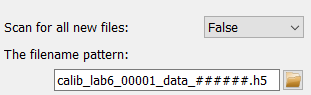

..
    This file is licensed under the
    Creative Commons Attribution 4.0 International Public License (CC-BY-4.0)
    Copyright 2023 - 2025, Helmholtz-Zentrum Hereon
    SPDX-License-Identifier: CC-BY-4.0

.. _directory_spy_frame:

Directory spy frame
===================

.. contents::
    :depth: 2
    :local:
    :backlinks: none
    
The *Directory spy* frame is a graphical interface to configure and run the 
:py:class:`DirectorySpyApp <pydidas.apps.DirectorySpyApp>`. It is split in two 
main parts: On the left are the controls for configuring and running the 
application. The right part of the frame is taken by a visualization widget for 
the latest images read from the :py:class:`DirectorySpyApp 
<pydidas.apps.DirectorySpyApp>`.

The configuration on the left holds widgets to configure all necessary
application Parameters as well as to start and stop running the actual 
application.

Configuring the input
---------------------

Data source
^^^^^^^^^^^

.. image:: images/dir_spy/path.png
    :align: left

The first Parameter the user must define is the working path for the app. Either
copy the full directory path in the field or use the *Open* button to select a 
path in a pop-up window.

The default settings of the app is to scan for files corresponging to a specific
file-naming pattern. An existing file can be selected using the *Open* button 
and its filename modified to exchange the counters in the filename with 
hashtags. An example of a filename with wildcards is given on the right. Note 
that the Hdf5 dataset key Parameter widget is also shown automatically if a 
hdf5 file extension was detected.

.. image:: images/dir_spy/scan_for_all.png
    :align: left

If the :py:data:`scan_for_all` option has been selected, the filename pattern
Parameter will be hidded. Note that the Hdf5 dataset key Parameter is also 
shown and this dataset is looked for in all new files in the specified folder.

Image corrections
^^^^^^^^^^^^^^^^^

.. image:: images/dir_spy/corrections.png
    :align: left

The *Directory spy frame* allows to mask the images with the global detector 
mask, toggled by changing the corresponding Parameter value. 

In addition, a generic background image can be subtracted from all images. If 
this option is selected, the widget to select the filename is shown. If an 
hdf5 file was selected, the widgets for the selection of dataset and frame 
number are shown as well, see image on the right.

    
Running the App
---------------

.. image:: images/dir_spy/running.png
    :align: left    

Running the :py:class:`DirectorySpyApp <pydidas.apps.DirectorySpyApp>` in this
frame will automatically display the latest update in the presentation widget
on the right.

A single directory scan can be performed by using the *Show latest image* 
button. This will also trigger a guaranteed update of the display widget.

A continuous process can be started by using the *Start scanning* button. This
process will run until the pydidas UI is stopped or the *Stop scanning* button
has been pressed. Updates to the display widget will be send based on the 
frequency set in the global settings.

.. note::
    If a pattern has been selected, the app will perform a single scan of the 
    whole directory upon starting to determine the latest image. To minimize
    file system access, it will then only look for the next consecutive file
    (and consequently, it will block if files are missing). To skip missing
    files, the user needs to restart the app.

.. tip::
    The minimum frequency in which the plot is updated is defined in the global
    settings. Therefore, if two updates came back-to-back, pydidas will 
    (depending on the settings) the second event and therefore will not show the
    latest image. A forced updated can be executed by using the *Force plot 
    update* button.

Image data visualization
------------------------

.. include:: ../silx/plot2d.rst

