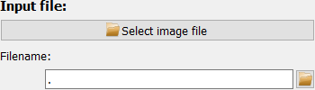

..
    This file is licensed under the
    Creative Commons Attribution 4.0 International Public License (CC-BY-4.0)
    Copyright 2023 - 2025, Helmholtz-Zentrum Hereon
    SPDX-License-Identifier: CC-BY-4.0

Image math frame
================

.. contents::
    :depth: 2
    :local:
    :backlinks: none

The *Image math* frame allows to perform mathmatical operations on input images.
The frame offers three buffers for input images and three buffers for result
images.

The left side holds the configurations while the image is displayed on the
right side.

The configuration on the left holds the following functions which will be
described in more detail below:

  - Image import
  - Image selection (for display)
  - mathmatical operations
  - Image export

Image import
---------------

..
    Note: The text for the import is similar to the one written for the
    beamcenter selection file input.

The input file can be selected in any one of four ways:

1. Use the "Select image file" button at the top.
2. Enter the full file path in the input field.
3. Use the small "open" button right of the input field.
4. Drag and drop a file from the system's file explorer.

.. image:: ../beamcenter/_images/input_hdf5.png
    :align: right

For hdf5 files, however, you need to select data the dataset and frame number
first and confirm the selection with the "Confirm input selection" button before
any frame is loaded and displayed.

If the filename is valid, the selected file will be displayed immediately. The
loaded file can be stored in one of three buffer positions, labeled *Input
image #1* through *[...] #3*:

|

Display image
-------------

.. image:: images/img_math/display.png
    :align: left

The display image drop-down box allows to select an image to be displayed in the
plot:

.. image:: images/img_math/dropdown.png
    :align: left

The *opened file* always corresponds to the latest file (or frame within the
file) which has been loaded. The *Input image #i* are the buffers for stored
input images (if used) and processed images are stored in the the *Image #i*
buffers.

In addition, the currently displayed image can always be accessed as the
*current image*.

Image operations
----------------

The Image math frame offers three groups of operations:

1. Elementaray arithmetic operations between an image and a number, for example
   addition of a number to the image values.
2. Applying operators on an image, for example for taking the log of the image.
3. Arithmetic operations of two images like subtracting one image from another.

Each of these groups has their own configuration widgets. For all image
operations, the user must define the output image where there results shall be
stored. By default, this is *Image #1* but this can be changed with the
drop-down selection.

Elementary arithmetic operations
^^^^^^^^^^^^^^^^^^^^^^^^^^^^^^^^

This section allows to perform the four basic operations (addition, subtraction,
division, multiplication) between an image and a number. The operator must be
selected in the drop-down menu and the value can be entered in the edit box.
Clicking the button *Apply arithmetic operation* will execute the operation,
store the result in the selected output buffer and display the resulting image.

Image operators
^^^^^^^^^^^^^^^

The *Apply operator to image* option allows to perform pixel-wise operations on
the image. Some operators have a numerical value as second input. The list of
operators is given below:

.. list-table::
    :widths: 15 15 70
    :class: tight-table
    :header-rows: 1

    * - operator
      - additional inputs
      - description
    * - absolute
      - /
      - Take the absolute value of the input image.
    * - exp
      - /
      - Calculate :math:`exp \left( I \right)`
    * - fmax
      - low :math:`x_0`
      - Calculate the (pixel-wise) maximum :math:`\max \left( I, x_0 \right)`.
        This is essentially a lower threshold :math:`x_0`.
    * - fmin
      - high :math:`x_1`
      - Calculate the (pixel-wise) maximum :math:`\min \left( I, x_1 \right)`.
        This is essentially an upper threshold :math:`x_1`.
    * - log
      - /
      - Calculate the natural logarithm of the image
        :math:`\ln \left( I \right)`.
    * - log2
      - /
      - Calculate the base-2 logarithm of the image
        :math:`\log_2 \left( I \right)`.
    * - log10
      - /
      - Calculate the base-10 logarithm of the image
        :math:`\log_{10} \left( I \right)`.
    * - power
      - exponent *y*
      - Calculate the input taken to *y's* power :math:`x^y`.
    * - sqrt
      - /
      - Calculate the square root of the input image.

Arithmetic image operations
^^^^^^^^^^^^^^^^^^^^^^^^^^^

Similar to the *elementary arithmetic operations*, this function also allows to
perform arithmetic operations, but on two images instead of an image and a
number. Select the input images and the operator to calculate and display the
resulting new image.

Image export
------------

Clicking the export button opens a dialog to select a filename to save the
current image to disk.

Data visualization
------------------

A modified silx Plot2D widget is used for displaying the data and is
described in detail below.

.. include:: ../silx/plot2d.rst
