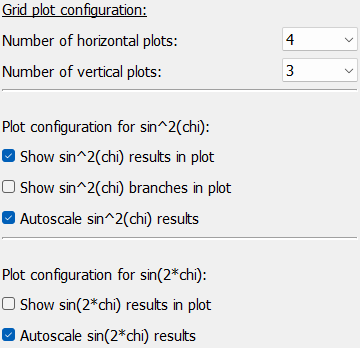
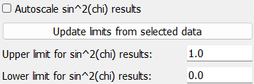
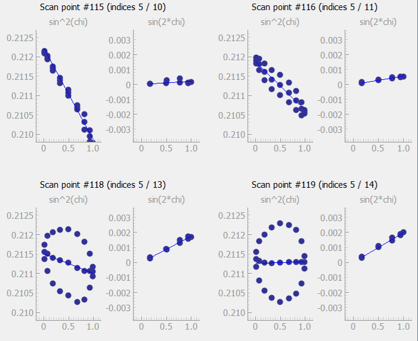

..
    This file is licensed under the
    Creative Commons Attribution 4.0 International Public License (CC-BY-4.0)
    Copyright 2025, Helmholtz-Zentrum Hereon
    SPDX-License-Identifier: CC-BY-4.0

Sin square chi results visualization frame
==========================================

.. contents::
    :depth: 2
    :local:
    :backlinks: none

The *Sin square chi results visualization* frame allows to inspect the results
of the *Sin square chi* analysis.

.. image:: images/sin_square_chi/overview.png
    :width: 600px
    :align: center

The frame includes controls for selecting
the input source and for controlling the display of the results on the left.
The data is displayed on the right side in a grid of plots. Controls for browsing
through the data are included on the bottom of the data display area.

Data selection
--------------

.. image:: images/sin_square_chi/data_import.png
    :align: left

Data for visualization can be selected in one of two ways: First, the current
workflow results can be imported into this frame by clicking the *Import current
workflow results* button. This will load a copy of the current workflow results.
Second, results can be imported from a directory with exported pydidas results.

|

.. tip::
    When importing results from disk, only the directory needs to be selected.
    Pydidas will determine which nodes include results and will make these
    available for visualization.

The name of the selected directory (or *Workflow results* in case of the
current results) is displayed for convenience.

The nodes which contain the exported results of the *sin^2(chi)* fit and the
*sin(2*chi)* fit are automatically detected and displayed in the respective
drop-down boxes. A choice of *no selection* is equivalent to disabling plotting
for that type of plot.

Plot controls
-------------

The plot controls allow to modify how the data is displayed. Controls for
the number of horizontal and vertical plots allow to change the number of
rows and columns of plots in the grid.

Checkboxes allow disabling of showing of the selected *sin^2(chi)* and *sin(2*chi)*
nodes completely. Note that when no data was selected through the *no selection*
setting in the data selection, these entries will be ignored.

The *sin^2(chi) fit* configuration also has a toggle to display the positive and
negative branches of the analysis. Unchecking this box will only plot the average
data and the linear fit.

The autoscale checkboxes control the scaling. When autoscaling is enabled, all
plots will be scaled to the same range, which is determined by the minimum and
maximum of the data in all plots (of the same type). When autoscaling is disabled, the
user can set the minimum and maximum values for the y-axis of each plot individually.
Note that the x-axis is always autoscaled to the range (0, 1). A button allows to
update the manual scales from the data. These can be further modified by the user.

Data display
-------------

The data display area shows the results of the *sin^2(chi)* and *sin(2*chi)* fits,
if selected in the data selection. Each plot has a small title with the type of plot.
The grid of plots also includes titles with the scan point (i.e. the consecutive
number in the acquisition sequence) as well as the indices of the point on each
of the scan axes.

Panning and zooming of the plots is disabled by default to keep the scale of all plots
comparable.

Data selection and navigation
-----------------------------

The bottom of the data display area includes controls for navigating through the
data. The currently selected scan points are displayed in the center as the current
selection. These can also be modified by the user which will update the displayed
data. The buttons on the left and right allow to navigate through the data and are
described in detail in the following table:

.. list-table::
    :widths: 30 70
    :class: tight-table
    :header-rows: 1

    * - button
      - description
    * -  .. image:: images/sin_square_chi/button_start.png
            :align: center
      - Go to the start of the scan and visualize the first scan points.
    * -  .. image:: images/sin_square_chi/button_page_back.png
            :align: center
      - Go back by one page. This will display the previous set of scan
        points in the grid of plots, i.e. all plots will be updated with the previous
        scan points. For example, if the grid inlcudes 3x5 plots, the previous
        15 scan points will be displayed.
    * -  .. image:: images/sin_square_chi/button_back.png
            :align: center
      - Display the previous scan point in the grid of plots. This will update
        the first plot with previous scan point and all other plots will be shifted.
    * -  .. image:: images/sin_square_chi/button_forward.png
            :align: center
      - Display the next scan point in the grid of plots. This will update
        all plots with the next scan point, i.e. the last plot will show the next
        scan point and the other plots will be shifted in the grid.
    * -  .. image:: images/sin_square_chi/button_page_forward.png
            :align: center
      - Go forward by one page. This will display the next set of scan points
        in the grid of plots, i.e. all plots will be updated with the next scan
        points. For example, if the grid inlcudes 3x4 plots, the next 12 scan points
        will be displayed.
    * -  .. image:: images/sin_square_chi/button_end.png
            :align: center
      - Go to the end of the scan and visualize the last scan points. The last
        scan points will always be displayed in the last plot of the grid. The other
        plots will be updated with the previous scan points, as available.
