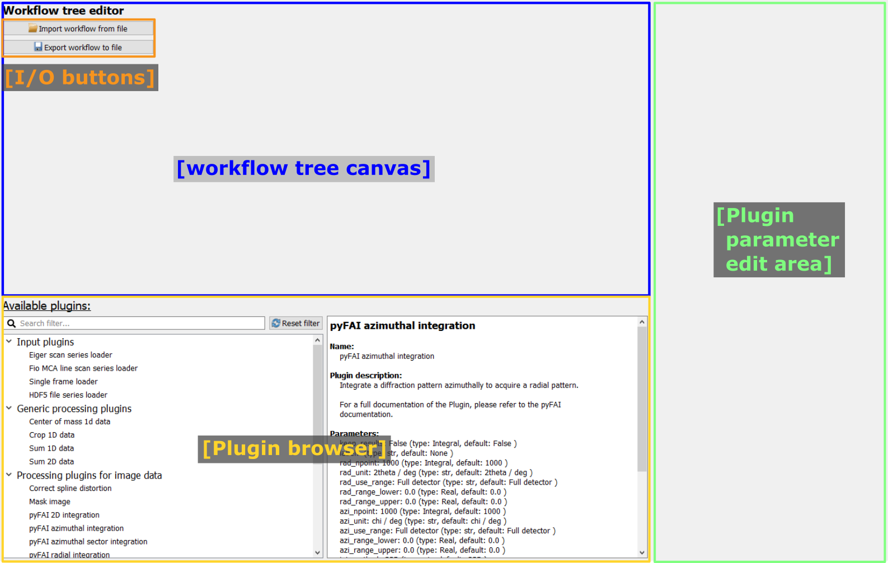
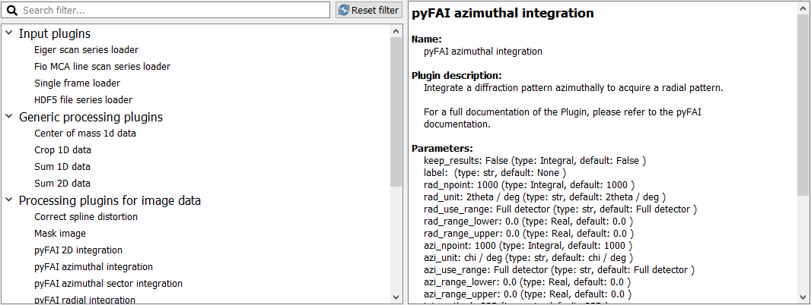
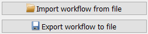

..
    This file is licensed under the
    Creative Commons Attribution 4.0 International Public License (CC-BY-4.0)
    Copyright 2023 - 2025, Helmholtz-Zentrum Hereon
    SPDX-License-Identifier: CC-BY-4.0

.. _workflow_edit_frame:

Workflow edit frame
===================

.. contents::
    :depth: 2
    :local:
    :backlinks: none

The :py:class:`WorkflowTree <pydidas.workflow.ProcessingTree>` can
be visualized and edited in the Workflow edit frame. The starting layout of the
frame is shown below.

- I/O buttons
    Buttons for importing and exporting the workflow are situated here.
- Workflow tree canvas
    This is the area where the visualization of the
    :py:class:`WorkflowTree <pydidas.workflow.ProcessingTree>`
    and its :py:class:`WorkflowNodes <pydidas.workflow.WorkflowNode>`.
- PluginBrowser
    This widget displays all available Plugins in the PluginCollection on the
    left as well as a description of the selected plugin on the right.
- Plugin parameter edit area
    Once a Plugin has been added to the WorkflowTree, its Parameters can be
    edited here after selecting the respective plugin.

.. _workflow_plugin_presenter:

Plugin browser
--------------

The Plugin collection presenter consists of two parts. On the left, it will show
all Plugins which have been registered with the :py:class:`PluginCollection
<pydidas.plugins.plugin_collection.PluginRegistry>` (for more information
about how paths are managed, please refer to :ref:`global_plugincollection`).
On the right, it shows detailed information about the selected plugin:

A filter can be selected at the top of the left part to display only plugins
with matching names.

A single click on a Plugin's name on the left will show more information about
the selected Plugin on the right. This information included the description, a
full list of Parameters, the input and output data dimensions as well as further
programmatic information (class name and plugin type).

A double click on a Plugin's name will append a new instance of the Plugin to
the :py:class:`WorkflowTree <pydidas.workflow.ProcessingTree>`.
The new instance will always be appended to the currently active Plugin (or it
will become the new root Plugin if the Tree is empty).

.. image:: images/edit/node_menu.png
    :align: left

Left-clicking on a Plugin name will open a context menu with additional options:
The user can replace the active node, append a new :py:class:`WorkflowNode
<pydidas.workflow.WorkflowNode>` to the active node or append to a specific
node. The *Append to a specific node* menu entry will open a new sub-menu with
a list of all nodes in the :py:class:`WorkflowTree
<pydidas.workflow.ProcessingTree>`.

.. tip::
    Adding a new node to the WorkflowTree will also activate that node.

    To make a branching tree, you will need to activate the original node
    again after adding the first new node.

.. _workflow_tree_canvas:

Workflow tree canvas
--------------------

.. image:: images/edit/canvas.png
    :width: 500px
    :align: center

The image above shows an example :py:class:`WorkflowTree
<pydidas.workflow.ProcessingTree>` visualization. Each plugin is
depicted in a box with its node number and name and connections between nodes
are displayed with lines. The color and frame indicate the status of the
selected :py:class:`WorkflowNode <pydidas.workflow.WorkflowNode>`:

    - Blue background, bold frame
        The currently selected, active :py:class:`WorkflowNode
        <pydidas.workflow.WorkflowNode>`
    - Grey background, regular frame
        A consistent :py:class:`WorkflowNode
        <pydidas.workflow.WorkflowNode>` in the :py:class:`WorkflowTree
        <pydidas.workflow.ProcessingTree>`; not currently selected.
    - Red background
        An inconsistent :py:class:`WorkflowNode
        <pydidas.workflow.WorkflowNode>` in the :py:class:`WorkflowTree
        <pydidas.workflow.ProcessingTree>`: The input data
        dimension of the node's plugin do not match the output data dimension of
        its parent.
    - Red background, bold frame
        An inconsistent :py:class:`WorkflowNode
        <pydidas.workflow.WorkflowNode>` which has been selected as active
        node.

.. note:
    Note that children of an inconsistent plugin will also be regarded of
    inconsistent, irrespective of the actual consistency.

By clicking on a plugin, this plugin gets selected and is highlighted
(bold border and change in background color). In addition, the
:ref:`workflow_plugin_param_editing` widget will display the selected plugin's
Parameters.

Removing nodes from the WorkflowTree
^^^^^^^^^^^^^^^^^^^^^^^^^^^^^^^^^^^^

.. image:: images/edit/node_x_button.png
    :align: left

Clicking on the :py:data:`x` button in the top right corner of a
:py:class:`WorkflowNode <pydidas.workflow.WorkflowNode>` widget will open a
context menu to delete the current node or branch:

- Delete this node
    Using this option will remove only the current node and connect the node's
    children with the node's parent.
- Delete this branch
    This option will delete the current node and all its children (recursively).

Rearranging nodes in the WorkflowTree
^^^^^^^^^^^^^^^^^^^^^^^^^^^^^^^^^^^^^

The Workflow tree canvas supports rearranging :py:class:`WorkflowNodes
<pydidas.workflow.WorkflowNode>` by drag & drop: Click and hold a node and move
it on another plugin, then release. This will make the dropped node a child of
the node on which it was dropped. All of the dragged node's children will be
moved as well.

.. _workflow_plugin_param_editing:

Plugin Parameter editing
------------------------

.. image:: images/edit/node_param_edit.png
    :align: left

After selecting a Plugin in the :ref:`workflow_tree_canvas`, the Plugin
Parameter editing widget will be updated with the information from the selected
Plugin. The first two lines are the plugin name and the node ID.

The "Restore default Parameters" button can be used to reset all of the active
plugin's Parameters to their defaults.

Below, all of the Plugin's Parameters are listed. Please refer to the
:ref:`gui_editing_parameters` manual on how to change these.

All Plugins have two generic Parameters: :py:data:`keep_results` and
:py:data:`label`. By default, pydidas only stores results of workflow leaves,
i.e. if a :py:class:`WorkflowNode <pydidas.workflow.WorkflowNode>` does not
have any children. When :py:data:`keep_results` is set to
:py:data:`True`, pydidas will store this node's results irrespective of its
position in the WorkflowTree.

The :py:data:`label` allows the user to give the plugin a reference name. This
name will be used as identifier when displaying or exporting data.

.. tip::

    When saving Workflow results, the filenames will be in the format

    node\ _\ **<node ID>**\ _\ **<label>**\ _\ <plugin_class>.<extension>

    where all placeholders in <> brackets will be replaced by values. Users are
    therefore encouraged to select meaningful labels for their Plugins and to
    make a note of the plugin node IDs.

Some plugin have additional advanced Parameters, which can be edited after
clicking the "Display advanced Parameters" button at the bottom of the list.

Also, some plugin have unique Parameter editing widgets which might have
additional functionality or logic. For example, pyFAI integration plugins have
the option to select the integration region graphically buttons are added to
use this functionality.

Import and Export
-----------------

Workflows can be imported and exported using the respective buttons in the
top left corner of the frame. Both buttons will open a file selection
dialogue and have filters implemented to allow only supported file types and
extensions.

Using the WorkflowTree
----------------------

The :py:class:`WorkflowTree <pydidas.workflow.ProcessingTree>`
is used automatically by pydidas to run processing workflows. The user does not
need to access it directly.
