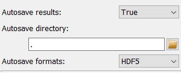

..
    This file is licensed under the
    Creative Commons Attribution 4.0 International Public License (CC-BY-4.0)
    Copyright 2023 - 2025, Helmholtz-Zentrum Hereon
    SPDX-License-Identifier: CC-BY-4.0

.. _workflow_run_frame:

Run full workflow frame
=======================

.. contents::
    :depth: 2
    :local:
    :backlinks: none

The *Run full workflow* frame allows to execute the current workflow with the 
current scan and experiment configurations. 

The "Run full workflow" frame is split in two main parts. On the left are the 
controls for the configuration of running the Workflow, the automatic saving 
as well as for manual data export. The right part of the frame is taken by a 
visualization widget for 1d plots or 2d images, depending on the result 
selection.

.. image:: images/run/overview.png
    :width: 600px
    :align: center

The configuration on the left holds four different functionalities which will be 
described in more detail below:

  - Configuration of the automatic result saving
  - Running the workflow
  - Selecting the results to be plotted
  - Manually exporting results

In addition, the data display allows to visualize one-dimensional and 
two-dimensional results on the fly.

.. tip:

    Data can be visualized while the processing is still running and the results
    will be updated as more results become available.

Control elements
----------------

Automatic saving
^^^^^^^^^^^^^^^^

.. image:: images/run/no_autosave.png
    :align: left
    
The configuration of the automatic saving is the topmost item on the left of the
frame. By default, autosaving the results is disabled and only the toggle 
Parameter to enable it is visible. Enabling the autosave will show two 
additional Parameter configuration widgets to select the saving directory and 
the type of files. 

.. note::

    The autosave directory must be an empty directory at the start of the 
    processing, even though this condition is not enforced at the time of 
    selection.
    

Files will be automatically created based on different autosave formats selected
in the Parameter.

.. warning::

    Automatic saving is fairly slow because of the required disk write access
    for every processed scan point and is only advisable for workflows which
    have very long processing times.

Running the workflow
^^^^^^^^^^^^^^^^^^^^

.. image:: images/run/to_start.png
    :align: left

The processing can be started with a click on the corresponding button. This 
will show a progress bar and an "Abort" button. 

.. image:: images/run/active.png
    :align: left
    
The "Abort" button will let the user send termination signals to the worker 
processes and - depending on the type of calculations - may take a while to take 
effect because the current process might not accept the termination signal 
until it starts a new job.

Workflow result selection
^^^^^^^^^^^^^^^^^^^^^^^^^

.. include:: ./workflow_result_selection.rst

Export of results
^^^^^^^^^^^^^^^^^

.. include:: ./workflow_result_export.rst

Data display
------------

.. include:: ../silx/plot1d.rst

.. include:: ../silx/plot2d.rst
