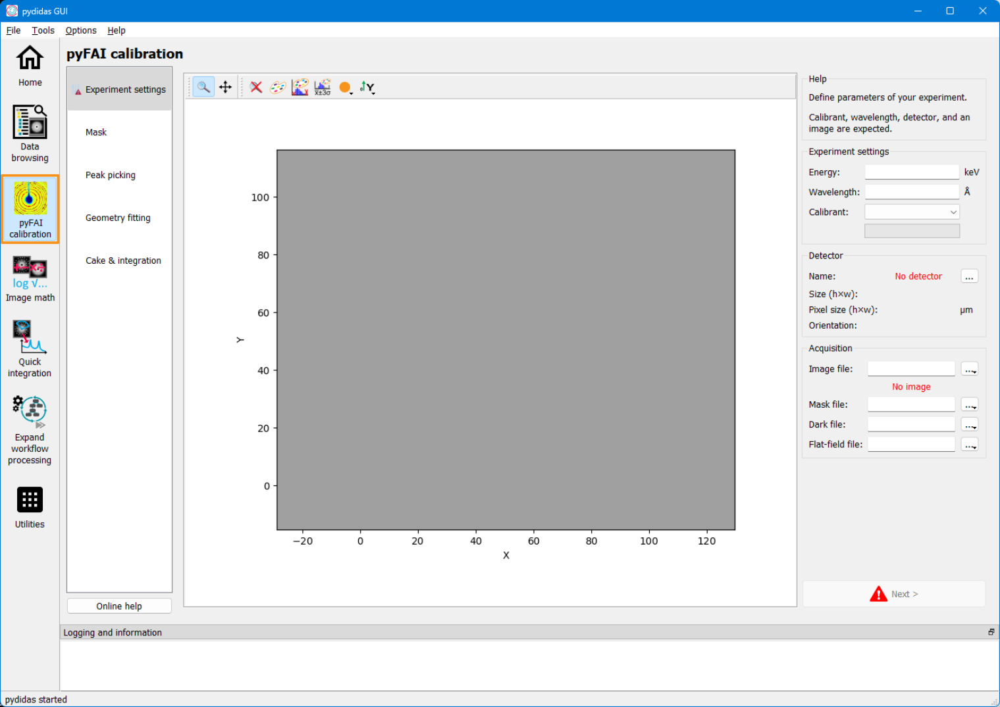
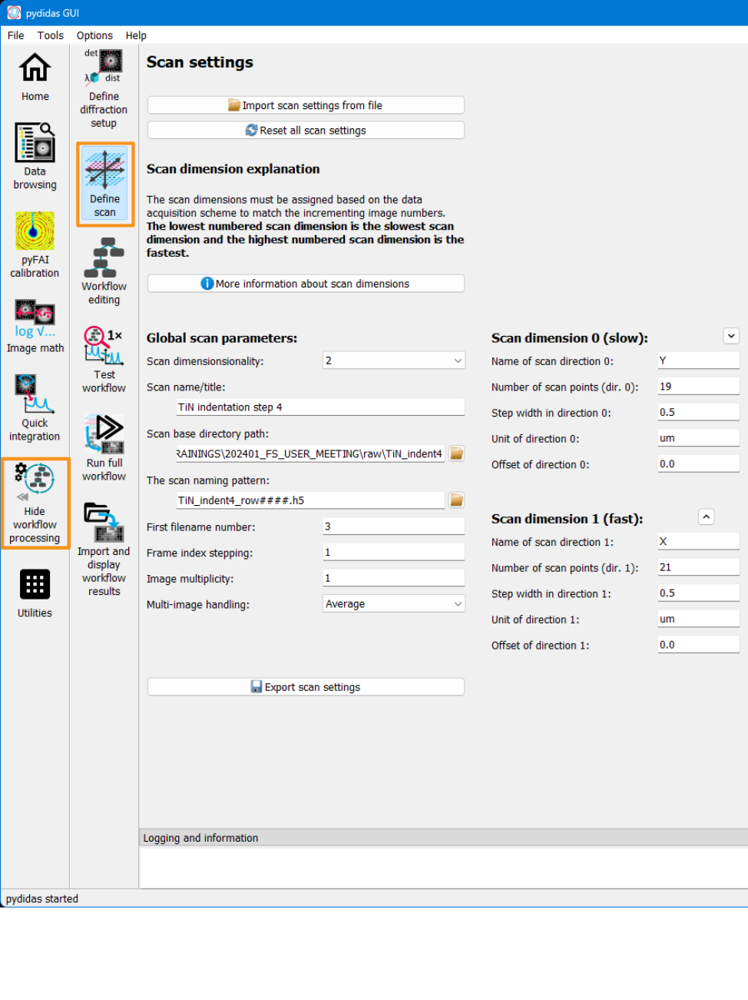
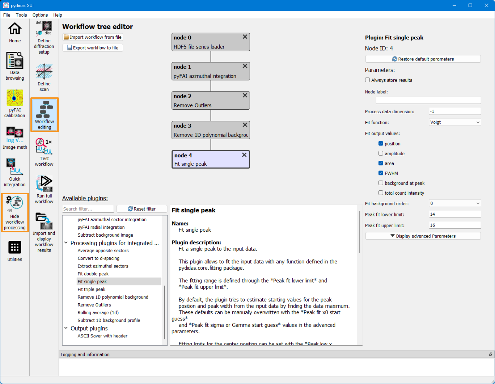
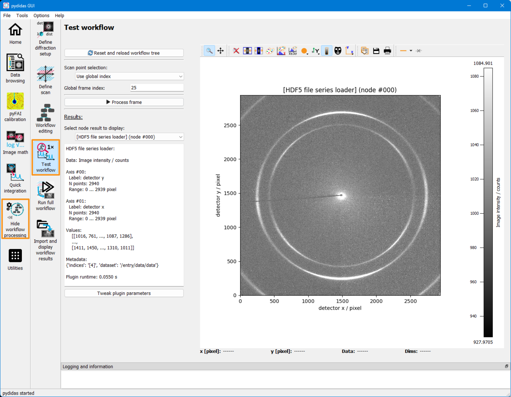
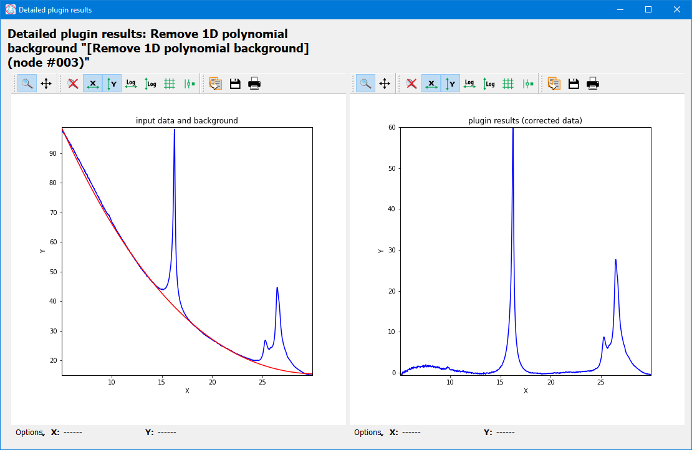
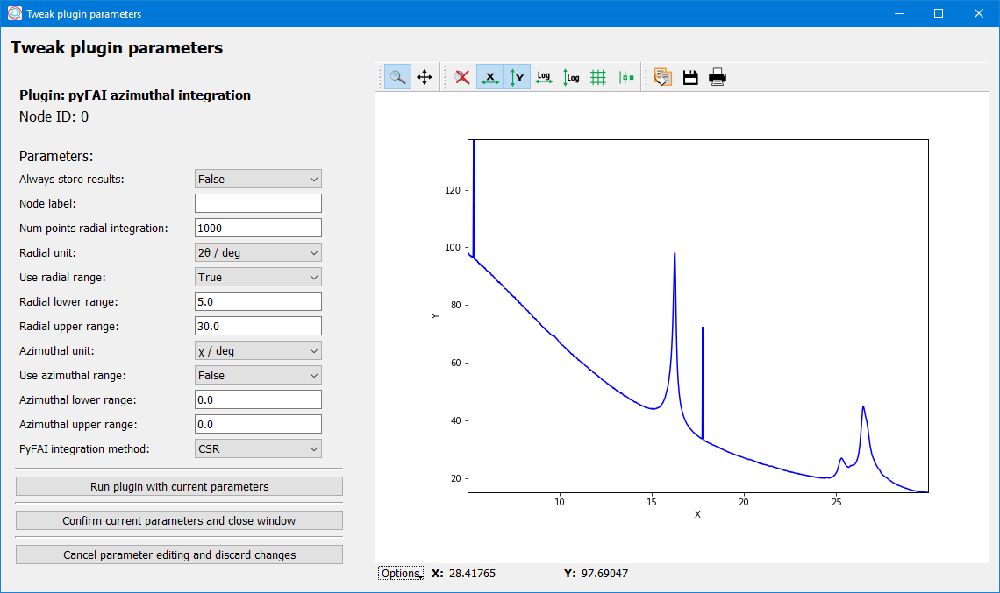
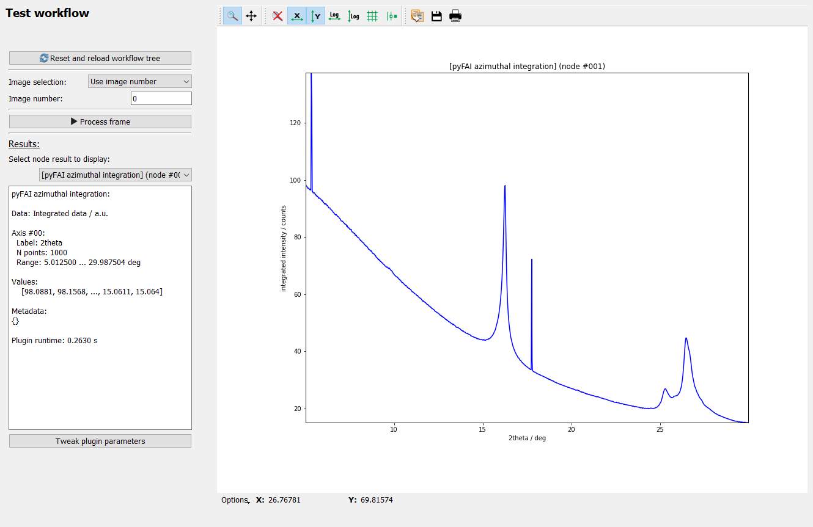
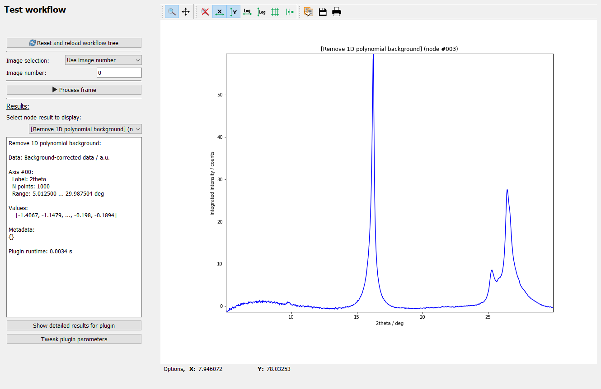
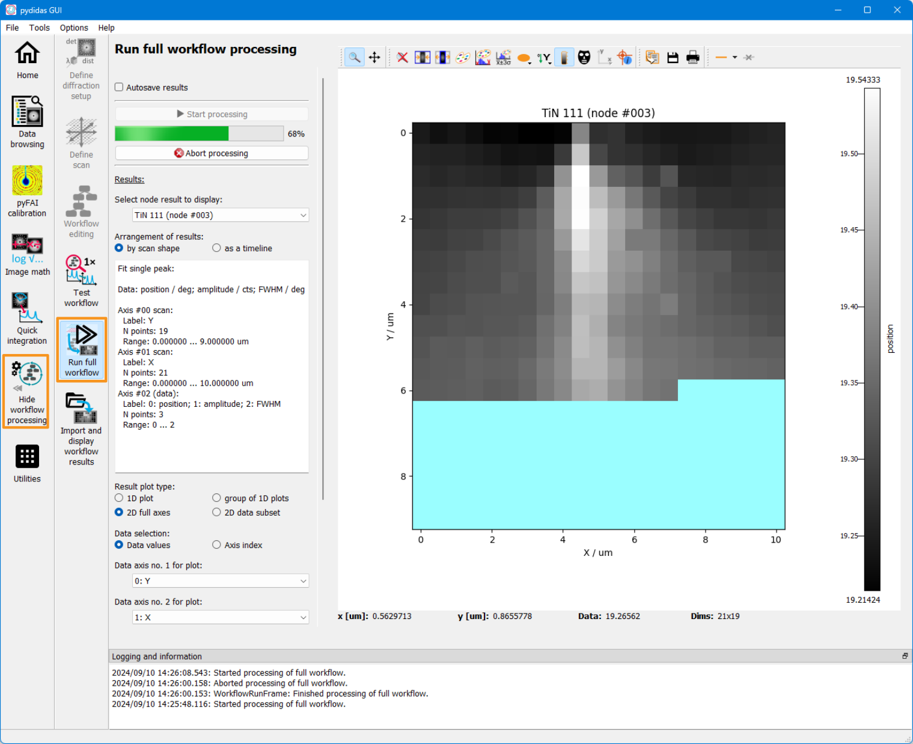

..
    This file is licensed under the
    Creative Commons Attribution 4.0 International Public License (CC-BY-4.0)
    Copyright 2024 - 2025, Helmholtz-Zentrum Hereon
    SPDX-License-Identifier: CC-BY-4.0

Using the pydidas processing pipeline
=====================================

.. contents::
    :depth: 2
    :local:
    :backlinks: none

.. note::

    While setting up and using the pydidas processing pipeline is also available
    from the command line, creating and editing the
    :py:class:`WorkflowTree <pydidas.workflow.processing_tree.ProcessingTree>`,
    :py:class:`DiffractionExperimentContext
    <pydidas.contexts.diff_exp.DiffractionExperiment>`, and
    :py:class:`ScanContext <pydidas.contexts.scan.Scan>` are more easily
    done in the graphical user interface and therefore, this guide covers
    the GUI.

To process data from scratch, the following steps need to be performed:

    1. Perform the detector calibration (in pyFAI geometry)
    2. Define the experimental setup (X-ray energy, detector, geometry) using
       the calibration.
    3. Define the scan (paths, filenames and scanpoints).
    4. Define the workflow which defines which operations to perform on the
       data.
    5. Test the workflow and tweak processing parameters (optional).
    6. Run workflow and save results.

Each of the steps will be explained in detail below. Also, an example will be
used for demonstration of each step.

1. Detector calibration
-----------------------

The detector calibration can best be performed using the *pyFAI-calib2* tool.
A version of this tool is implemented in pydidas and can be accessed directly
through the toolbar menu on the left (circled in orange):

For a tutorial on how to use the *pyFAI-calib2* tool, please refer directly
to the `pyFAI calibration tutorial
<https://pyfai.readthedocs.io/en/master/usage/cookbook/calib-gui/index.html#cookbook-calibration-gui>`_\ .

2. Define the experimental setup
--------------------------------

.. image:: images/02_exp_setup.png
    :align: left
    :width: 300px

The pydidas frame to edit the experimental setup can be accessed through the
*Workflow processing* -> *Define experimental setup* toolbar entries (marked
in orange on the left).

If you just performed the detector calibration, use the 2nd button from the top
*Copy all experimental parameters from calibration* to automatically update
all Parameter values, with the exception of the detector mask.

If you want to re-use a previous detector calibration, use the topmost button
*import experimerimental parameters from file* to open a file selection
dialogue. After confirming the selected file, the parameters are updated.
Note that the *detector mask file* parameter is not included in pyFAI's
.poni file format and is not updated when importing a poni file.

The *detector mask file* must be set independently of the pyFAI calibration
parameter import, if it has not been set in the pyFAI calibration.

For more details, please refer to the :ref:`define_diffraction_exp_frame`
manual.

Example
^^^^^^^

The example has been performed at an X-ray energy of 13 keV using an Eiger 9M
detector. This information was available from the beamline. The mask file for
the detector was saved at *E:\test\eiger_mask.npy* (in numpy binary format).
All the information was copied from the detector calibration.

3. Define the scan
------------------

Scan parameters and metadata can be edited on the *define scan* frame which can
be accessed through the *Workflow processing* -> *Define scan* toolbar entries
(marked in orange in the image above).

All of the *global scan parameters* (except for the scan title) found in the
left column are mandatory, whereas on the number of scan points is mandatory
for each scan dimension.

The parameters for the scan base directory and naming pattern allow pydidas to
find the data and read the correct files. The number of scan points in each scan
dimension allows pydidas to re-arrange the input data in the correct shape.
The additional parameters for the individual scan dimensions are used for
annotating the results and for giving meaningful values to the dimensions but
they are not strictly necessary.

For more information, please refer to the :ref:`define_scan_frame` manual.

Example
^^^^^^^

In the example used in the image above, the individual image files are located
in the E:\test\raw directory and the data files are named test_00010_data.h5,
test_00011_data.h5, etc. (therefore, the starting index is set to 10).

One image was acquired at each scan point in a mesh of 25 x 25 points.

4. Creating the workflow
------------------------

To create the workflow, select the *Workflow processing* - > *Workflow editing*
toolbar entry (marked in orange in the image above).
The workflow is comprised of individual plugins which each perform a single
task, like frame loading, azimuthal integration, background correction,
peak fitting. The workflow can branch downward in an unlimited number of nodes
(subject to processing resources).

Use the Plugin browser at the bottom of the frame to display more information
about and to select plugins. Double click on any plugin to add it as child to
the current plugin or use the right mouse button on a Plugin to open a menu with
additional options.

Clicking on a plugin in the field at the top selects it and opens these plugin's
parameters on the right side for editing. Plugins can also be rearranged by
drag & drop.

For additional information, please refer to the :ref:`workflow_edit_frame`
manual.

Note that pydidas by default only stores the result of leaves (i.e. plugins
which have no children). If you want to store additional results, please set the
*Always store results* parameter to :py:data:`True`.

Example
^^^^^^^

In the example used above, the plugins have been used with most of their default
settings. Only the radial integration has been limited to [5, 30] degrees in the
*pyFAI azimuthal integration* plugin (to have a region with a smooth background
which can be well subtracted) and the *Fit single peak* has been changed to use
a Lorentzian function and to set the limits.

5. Testing the workflow
-----------------------

Once the parameters for Experiment, Scan and and Workflow have been configured,
the Workflow can be tested. Select the *Workflow processing* - > *Test Workflow*
toolbar entry (marked in orange in the image above).

Pick a good datapoint by using either the image number or scan indices and click
the button *Process frame* to run the workflow locally. Note: To avoid overhead,
the workflow is executed in the same process and is blocking. Especially using
any pyFAI integration for the first time will require a few seconds to set up
the matrix tables.

The *Results* dropdown selection allows to see the results for any plugin in the
workflow. The textbox on the left gives you additional information about the
plugin results, the window on the right plots the 2d image or 1d curve.
If you are not happy with the results, select the *Tweak plugin
parameters* button at the bottom to open a new window and edit this plugin's
parameters.

5.1 Plugin details
^^^^^^^^^^^^^^^^^^

Some plugins allow to inspect detailed results which can be anything and which
are defined in each plugin. The *Show detailed results for plugin* button opens
a new window with the details for the selected plugin.

Depending on the plugin, several images or plots can be shown in this window.
All plots are labelled. More information, including a legend, can be accessed
through the *Options* at the bottom of the plot.

5.2 Tweaking Parameters
^^^^^^^^^^^^^^^^^^^^^^^

Using the *Tweak plugin parameters* button on the *Test Workflow* frame opens
a new window which allows to modify Plugin parameters in place.

The *Run plugin with current parameters* will run the current plugin only and
display its results (and its details, if the plugin has them defined). Once
you have configured the plugin to your wishes, use the *Confirm current
parameters and close window* button. This will also run any child plugins with
the updated input data again.

Example
^^^^^^^

The resulting outputs for each plugin in the workflow are shown below:

.. figure:: images/05c_test_loader.png
    :width: 300px
    :align: center

    The imported image from the loader.

    The azimuthally integrated data.

.. figure:: images/05e_test_outliers.png
    :width: 300px
    :align: center

    The data after outlier removal.

    The data after polynomial background removal.

6. Running the full workflow
----------------------------

Once you are confident that everything is configured correctly, select the
*Workflow processing* - > *Run full Workflow* toolbar entry (marked in orange
in the image above). This will open the *Run full workflow* frame which allows
to run the workflow in separate processes in the background and to visualize
the results.

The *Start processing* button opens background processes, which perform the
actual processing and only communicate their results. Starting these processes
takes some time and once results come in, you can select one of the nodes from
the drop-down on the left to display their results. For details, please refer
to the :ref:`Run full workflow frame manual <workflow_run_frame>`.
