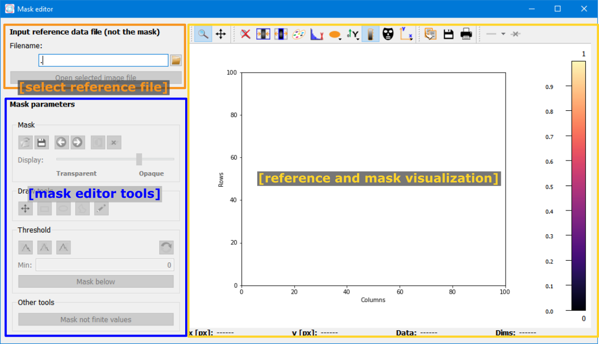

..
    This file is licensed under the
    Creative Commons Attribution 4.0 International Public License (CC-BY-4.0)
    Copyright 2023 - 2025, Helmholtz-Zentrum Hereon
    SPDX-License-Identifier: CC-BY-4.0

.. _mask_editor_window:

Mask editor window
==================

The mask editor window allows to create or edit a mask with drawing tools or
threshold values.

The main elements in the Mask editor window are 
  
  - Reference file selection:
    
    Loading or editing a mask first requires a reference data file to be 
    imported. Use the *Filename* Parameter to select a file and the 
    :py:data:`Open selected image file` button to import the selected file.
  - Mask editor tools:
  
    These tools allow to modify the mask and will be explained in detail below.
    
  - Reference and mask visualization:
  
    This widget allows to view the reference data file in the selected colormap.
    The mask will also be shown in a color which is complementary to the 
    selected colormap.
    
    

.. image:: images/mask_editor_tools.png
    :align: right

Mask editor tools
-----------------
    
The mask editor tools are a `silx MaskToolsWidget 
<http://www.silx.org/doc/silx/latest/modules/gui/plot/dev.html?highlight=mask#module-silx.gui.plot.MaskToolsWidget>`_
and can be used to modify the mask. The individual control elements are listed
below.

|
|
|
|
|
|

Mask
^^^^

The *Mask* box includes the following control elements (listed from left to
right):

.. list-table::
    :widths: 8 18 74
    :class: tight-table
    
    * - .. image:: images/mask_tools/mask_load.png
      - Load mask
      - Load a mask from a file. 
    * - .. image:: images/mask_tools/mask_save.png
      - Save mask
      - Save the current mask to file as binary image.
    * - .. image:: images/mask_tools/mask_undo.png
      - Undo
      - Undo the last change to the mask. (Shortcut: :py:data:`Ctrl + Z`)
    * - .. image:: images/mask_tools/mask_redo.png
      - Redo
      - Redo the last change to the mask. (Shortcut: :py:data:`Ctrl + Y`)
    * - .. image:: images/mask_tools/mask_invert.png
      - Invert 
      - Invert the mask and mask all un-masked pixels and vice versa.
        (Shortcut :py:data:`Ctrl + I`)
    * - .. image:: images/mask_tools/mask_clear.png
      - Clear mask
      - Clear the current mask and reset it to an empty mask. (Shortcut: 
        :py:data:`Del`)

In addition, the *Display* slider allows to control the transparency of the 
mask overlay on the reference image.

Draw tools
^^^^^^^^^^

The draw tools allow to add or remove regions to/from the mask, based on 
geometric shapes.

.. list-table::
    :widths: 8 18 74
    :class: tight-table
    
    * - .. image:: images/mask_tools/draw_pan.png
      - Pan
      - Pan the image (and mask) in the plot.
    * - .. image:: images/mask_tools/draw_rect.png
      - Draw rectangle
      - Draw a rectangle to mask/unmask a region. The operation (mask or unmask)
        is controlled by the radio buttons below the button.
    * - .. image:: images/mask_tools/draw_ellipse.png
      - Draw ellipse
      - Draw an ellipse to mask/unmask a region. The operation (mask or unmask)
        is controlled by the radio buttons below the button.
    * - .. image:: images/mask_tools/draw_polygon.png
      - Draw polygon
      - Draw a polygon to mask/unmask a region. The operation (mask or unmask)
        is controlled by the radio buttons below the button. To add points to 
        the polygon, left-click on the position to add. To close the polygon,
        right-click and select *Close the polygon*. (Shortcut :py:data:`S`)
    * - .. image:: images/mask_tools/draw_pencil.png
      - Pencil
      - Mask or unmask areas with a pencil. The operation (mask or unmask)
        is controlled by the radio buttons below the button. The pencil size
        can be edited by either entering a number for the *Pencil size* or using
        the slider to modify the number.
        (Shortcut :py:data:`P`)

Threshold
^^^^^^^^^

The threshold group allows to mask pixels based on their value in the reference
image.

.. list-table::
    :widths: 8 18 74
    :class: tight-table
    
    * - .. image:: images/mask_tools/thresh_min.png
      - Min threshold
      - Mask all pixels with a value below the minimum. Upon selecting this 
        threshold, a field to set the minimum value will be shown.
    * - .. image:: images/mask_tools/thresh_range.png
      - Range threshold
      - Mask all pixels within the range between min and max. Upon selecting 
        this threshold, a field to set the minimum and maximum values will be 
        shown.
    * - .. image:: images/mask_tools/thresh_max.png
      - Max threshold
      - Mask all pixels with a value higher than the max threshold. Upon 
        selecting this threshold, a field to set the maximum value will be 
        shown.
    * - .. image:: images/mask_tools/thresh_cb.png
      - Get values from colormap 
      - Get the values for minimum and maximum from the colormap range. 
      
To apply the selected threshold, simply click the :py:data:`Mask below`, 
:py:data:`Mask between`, or :py:data:`Mask above` button, depending on the 
selected threshold. 

Mask not finite values
^^^^^^^^^^^^^^^^^^^^^^

This button will mask all pixels in the image which have not finite values,
i.e. :py:data:`NaN`, :py:data:`inf` or :py:data:`-inf`.

Data display
------------

.. include:: ../silx/plot2d.rst
