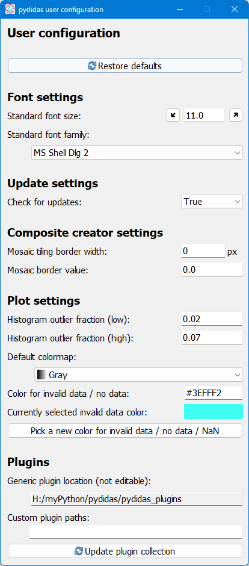

..
    This file is licensed under the
    Creative Commons Attribution 4.0 International Public License (CC-BY-4.0)
    Copyright 2023 - 2025, Helmholtz-Zentrum Hereon
    SPDX-License-Identifier: CC-BY-4.0

.. role:: raw-html(raw)
   :format: html

.. _user_config_window:

The User config window
======================

The *User config window* allows the user to customize the behaviour of their
pydidas copy. The *User config window* can either be accessed through the GUI menu
(Options :raw-html:`&rarr;` User config) or through the :ref:`utilities_frame`.

The individual Parameters are described below.

Using the :py:data:`Restore defaults` button will change all settings back to 
their default values.

Font settings
-------------

The font size and font family can be selected with the respective controls.
These settings are global for the full pydidas user interface. Font sizes 
between 5 and 20 points are supported.

The selection of fonts relies on the available system fonts. All TrueType 
scalable systems fonts are also available in pydidas.

The pydidas user interface will rescale itself based on the font metrics of 
the selection font size & family configuration. Selecting larger fonts will
grow all widgets and allows to rescale for high-DPI displays.

Update settings
---------------

The *Check for Updates* settings manages whether pydidas will automatically
check the github repository for an updated version. This check will only be
carried out with an active internet connection and the *Check for updates*
setting set to True.

.. list-table::
    :widths: 25 75
    :header-rows: 1
    :class: tight-table

    * - Parameter
      - Description
    * - Check for updates
      - Toggle whether pydidas will automatically check the github repository
        for an updated version at startup.

Composite creator settings
--------------------------

These settings determine how individual images are arranged into a mosaic
with the composite creator.

.. list-table::
    :widths: 25 75
    :header-rows: 1
    :class: tight-table

    * - Parameter
      - Description
    * - Mosaic tiling border width
      - The width (in pixels) of the border between adjacent images in
        composites.
    * - Mosaic border value
      - The value to be assigned to the pixels on the border between adjacent
        images.

Plot settings
-------------

These settings determine how plots are displayed and how specific buttons behave.
For detailed descriptions, please see the list below.

.. list-table::
    :widths: 25 75
    :header-rows: 1
    :class: tight-table
    
    * - Parameter 
      - Description
    * - Histogram outlier fraction (low)
      - [This setting is for 2D image displays only]. This Parameter defines
        which portion of the histogram should be ignored when defining the 
        lower limit for the colormap. The default value of 0.02 means that the
        lowest 2% of the histogram will be ignored for setting the colormap.
    * - Histogram outlier fraction (high)
      - [This setting is for 2D image displays only]. This Parameter defines
        which portion of the histogram should be ignored when defining the
        upper limit for the colormap. The default value of 0.07 means that the
        top 7% of the histogram will be ignored for setting the colormap. The
        default value was selected to cover all pixels in module gaps for an
        Eiger detector.
    * - Default colormap
      - The default colormap to be used for displaying 2D datasets. The 
        colormap can still be changed in each individual data window but those
        local changes are not persistent.
    * - Color for invalid data / no data
      - The color given for invalid data points or missing data points to
        distinguish them from the regular colormap. The color must be given in
        a RGB color code. The selected color is displayed in a box below the
        selection mask. A new color can also be selected in an interactive
        pop-up by using the *Pick a new color for invalid data / no data / NaN*
        button.

Plugins
-------

The *Plugin paths* allows to modify the path where pydidas plugins are located
or to add additional paths, for example for custom plugins.
The generic plugin path is given for reference only. The custom plugin paths accepts
multiple entries and **entries must be separated by a double semicolon ";;"**.

Changes to the plugin path will only take effect after using the 
:py:data:`Update plugin collection` button.

.. note::
    
    Updating the plugin collection will also clear any WorkflowTree currently
    defined / in use.